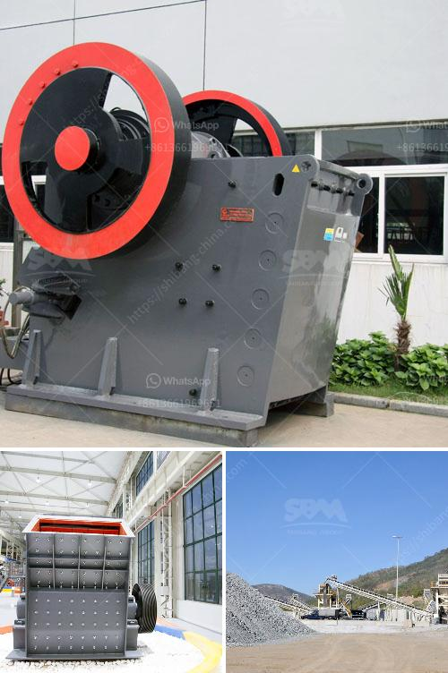

<h3>calcite milling equipment for sale</h3>
Calcite is a common mineral with extensive industrial use. It is a carbonate mineral with the chemical composition CaCO3. Calcium carbonate is one of the main components of limestone, marble, and chalk.

Calcite is widely used as a building material, as it is white and has excellent optical properties. It is also used in the production of glass, paint, and ceramics. In addition, calcite is used in the pharmaceutical, agricultural, and chemical industries.

To process calcite, it needs a calcite milling equipment for sale. However, not all calcite powder milling equipment are alike. For example, there are high-pressure micro powder milling equipment, which are in direct contact with materials and have stronger crushing capacity and higher efficiency.

There are also Raymond mills and ball mills for choice. The Raymond mill has a complete set of grinding equipment, in terms of structure, capacity, and fineness. It can be said that it is a high-quality equipment for calcite grinding. If you choose the Raymond mill, the grinding fineness is between 80-400 mesh, which is suitable for the production of 200 mesh calcite powder.

The ball mill is a more common equipment for calcite marble grinding. The whole machine is a vertical structure, which has a small footprint and convenient transportation. The ball mill uses rolling bearings to replace sliding bearings, which greatly reduces friction, easy starting, and significant energy savings. The finished powder has a fineness of 400-3000 mesh, which is suitable for the production of ultra-fine powder.

When choosing calcite milling equipment, the production capacity should be considered first. Different production requirements require different types of milling equipment. In addition, it is necessary to consider the hardness and humidity of the material. If the hardness is high or the moisture content is high, it is necessary to choose a mill with good wear resistance and drying capacity.

Another factor to consider is the maintenance and operation of the milling equipment. The mill should be easy to operate, with clear instructions and reliable after-sales service. It is important to choose a reputable manufacturer with a good reputation, high-quality products, and reasonable prices.

In conclusion, when looking for calcite milling equipment for sale, it is important to consider factors such as production capacity, material hardness, and moisture content. Raymond mills, ball mills, and high-pressure micro powder mills are all suitable choices. It is also important to choose a reputable manufacturer with good after-sales service. By selecting the right equipment, efficient and high-quality calcite powder production can be achieved.
<h3>Contact us</h3><ul><li><strong>Whatsapp:&nbsp;<a href="https://wa.me/8613661969651">+8613661969651</a></strong></li><li><a href="https://swt.shibang-china.com/?git&amp;zhl&amp;calcite milling equipment for sale"><strong>Online Service(chat now)</strong></a></li></ul><h3>Related</h3><ul><li><a href='10 inches marble grinding stone.md'>10 inches marble grinding stone</a></li><li><a href='gold refining equipment for sale.md'>gold refining equipment for sale</a></li><li><a href='marble crushing plants.md'>marble crushing plants</a></li><li><a href='ball mill machinery manufacturer india.md'>ball mill machinery manufacturer india</a></li><li><a href='conveyor belts raw material prices.md'>conveyor belts raw material prices</a></li></ul>