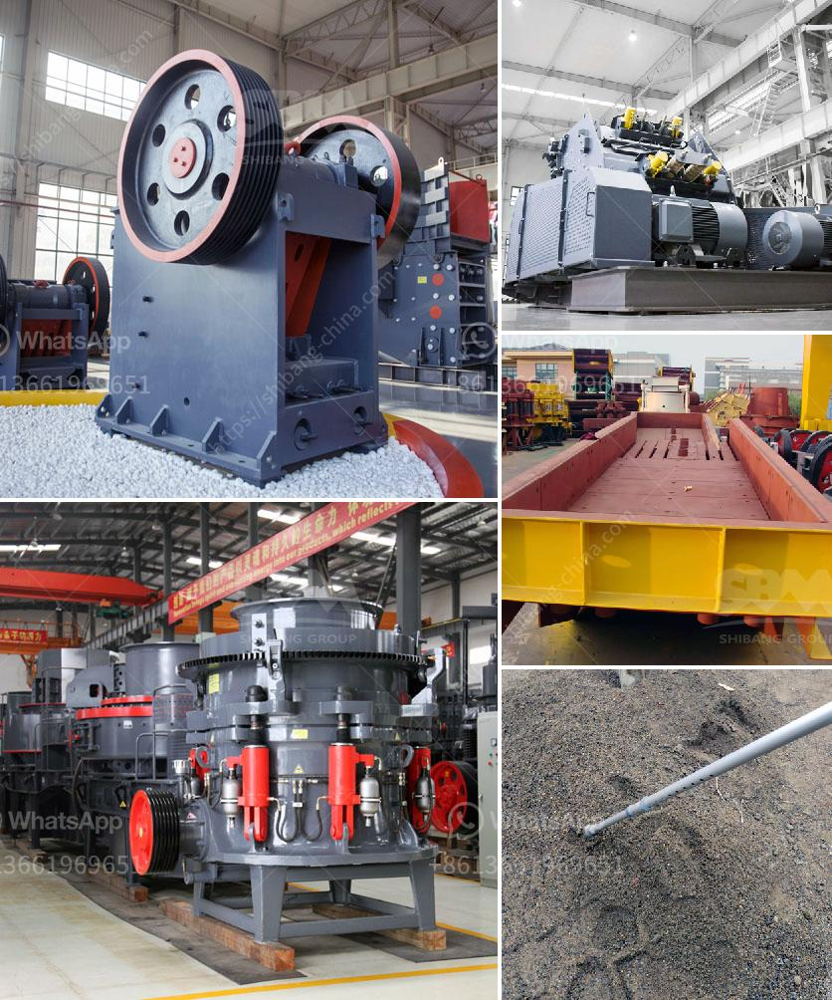

<h3>calcite powder grinding mill sale</h3>
Calcite powder grinding mill sale is a leading global manufacturer of crushing and milling equipment (calcite powder grinding mill sale), also supply individual (calcite powder grinding mill sale...) crushers and mills as well as spare parts of them. Offer advanced, rational solutions for any size-reduction requirements, including quarry, aggregate, grinding production and complete plant plan.

The grinding mills given by xsm are ball mill, raymond mill, vertical mill, trapezium mill, coarse powder mill, ultrafine mill etc. The ultimate grain size ball mill could be right down to 0.07mm. Kefid is generally a specialist manufacturer of calcite Crusher and Calcite Powder Grinding Mill. We export calcite powder grinding mill to South Africa, Vietnam, india, Kenya, Nigeria, Australia, Saudi Arabia, Indonesia, Pakistan, Peru, Mexico, Colombia, South Africa, Kenya, Algeria, Egypt, Ghana, Zimbabwe, Iran, Chile, Malaysia, Philippines, Sri Lanka, UAE, Zambia, Vietnam, Venezuela, Canada, Bolivia, Ecuador, Tanzania, Turkey, Sudan, Tunisia, Ukraine, Uzbekistan, Yemen, Uganda, Argentina, Oman, Congo, Germany, Bangladesh, America, Italy, Singapore, Libya, Angola, Tajikistan, Dubai, Brazilon, Peru ,Mexico,South Africa,Kenya,Algeria,Egypt,Ghana, Zimbabwe, Iran, Chile, Malaysia,Philippines,Sri Lanka, UAE,Zambia,Vietnam,Venezuela,Canada,Bolivia,Ecuador, Tanzania and so forth countries.

Calcite powder grinding mill sale is the development and change of the mineral resource market reflects the accelerated development of economic globalization, and the death of domestic mineral resources greatly enhances the international competence of the crusher and grinder machine.

Calcite powder grinding mill sale of guikuang is used to grind granular and powdered materials into powder with required fineness. guikuang is professional grinding mill manufacturer, which mainly specialize in limestone, dolomite, granite, calcite, basalt, barite, diabase etc. 

In calcite powder grinding mills in iran, XSM Group has designed and produced all kinds of crushing and grinding plants for the calcite powder machine sell in Jordan, Kazakhstan, Indonesia, Malaysia, Iran; the calcite powder machine and production line sell in Nigeria, Libya; the calcite powder machine and production line sell in Kenya, Ghana; the calcite powder machine and production line sell in Nepal, Thailand; the calcite powder machine and production line sell in Mozambique, Burma, Vietnam, Angola; the calcite powder machine and production line sell in Tanzania; the calcite powder machine and production line sell in Sri Lanka; the calcite powder machine and production line sell in Zimbabwe; the calcite powder machine and production line sell in Zambia; the calcite powder machine and production line sell in Egypt; the calcite powder machine and production line sell in Algeria.
<h3>Contact us</h3><ul><li><strong>Whatsapp:&nbsp;<a href="https://wa.me/8613661969651">+8613661969651</a></strong></li><li><a href="https://swt.shibang-china.com/?git&amp;zhl&amp;calcite powder grinding mill sale"><strong>Online Service(chat now)</strong></a></li></ul><h3>Related</h3><ul><li><a href='cost gypsum processing machines.md'>cost gypsum processing machines</a></li><li><a href='cement plant for sale south africa.md'>cement plant for sale south africa</a></li><li><a href='coal mill outlet temperature.md'>coal mill outlet temperature</a></li><li><a href='india edible clay making process.md'>india edible clay making process</a></li><li><a href='small scale mining equipment price in zimbabwe.md'>small scale mining equipment price in zimbabwe</a></li></ul>