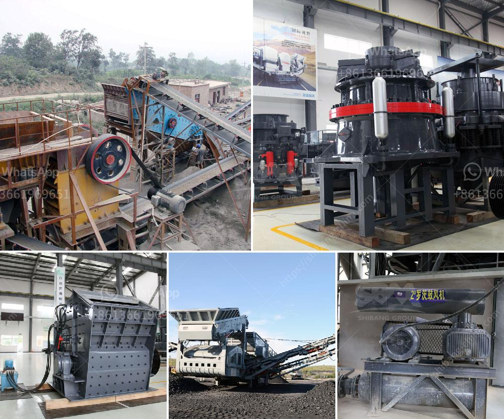

<h3>calcite processing equipment</h3>
Calcite is a common mineral found in many places around the world. It is primarily composed of calcium carbonate and forms in a variety of crystal shapes, making it desirable for use in a wide range of applications. To process calcite, there are many different types of equipment that can be used.

One of the most common methods for processing calcite is the use of grinding equipment. This equipment includes ball mills and Raymond mills. The ball mill is used to grind the calcite to a fine powder, while the Raymond mill is used to grind the calcite to a finer powder. The ball mill and Raymond mill can be used for calcite processing from initial raw material to powder production.

Another method for processing calcite is the use of crushing equipment. This equipment includes jaw crushers, impact crushers, and cone crushers. Jaw crushers are used to crush large pieces of calcite stone into small particles, while impact crushers and cone crushers are used to further crush the calcite into even smaller sizes.

After the calcite is crushed, it can be processed using vibrating screens to separate the different sizes of calcite particles. This allows for more efficient processing of the calcite and ensures that the final product is of high quality.

In addition to grinding and crushing equipment, calcite processing also requires various other equipment, such as vibrating feeders, belt conveyors, and auxiliary equipment. These machines work together to ensure a smooth and efficient processing process.

In recent years, the development of calcite ultrafine processing equipment has become increasingly important. This equipment, such as the ultrafine mill and high-pressure micro powder mill, can be used to process calcite powder with a fineness of 1250 mesh or even higher. This not only satisfies the various application requirements of calcite powder but also improves the economic benefits of calcite processing.

In conclusion, the processing of calcite requires a variety of equipment, including grinding and crushing equipment, vibrating screens, and auxiliary equipment. These machines work together to ensure that the calcite is processed efficiently and effectively. The development of ultrafine processing equipment has further improved the processing efficiency and economic benefits of calcite processing. With the help of advanced equipment, calcite can be processed into various products that are widely used in industries such as construction, chemical, and agriculture.
<h3>Contact us</h3><ul><li><strong>Whatsapp:&nbsp;<a href="https://wa.me/8613661969651">+8613661969651</a></strong></li><li><a href="https://swt.shibang-china.com/?git&amp;zhl&amp;calcite processing equipment"><strong>Online Service(chat now)</strong></a></li></ul><h3>Related</h3><ul><li><a href='stone crusher dealers.md'>stone crusher dealers</a></li><li><a href='talcum powder suppliers factories.md'>talcum powder suppliers factories</a></li><li><a href='impact crusher discount.md'>impact crusher discount</a></li><li><a href='ball mill in india.md'>ball mill in india</a></li><li><a href='silica quartz grinding plants bangalore.md'>silica quartz grinding plants bangalore</a></li></ul>