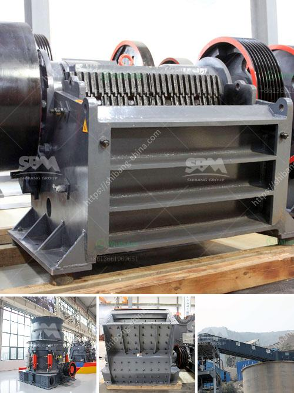

<h3>calcite production plant</h3>
Calcite is a versatile mineral used in various industries for its numerous applications. Calcite production plants play a crucial role in extracting and processing this valuable mineral, ensuring its availability for use in various consumer and industrial products.

Calcite, a carbonate mineral, is primarily composed of calcium carbonate (CaCO3). It is commonly found in the form of limestone sedimentary rocks. The mineral has a wide range of uses due to its exceptional properties, such as its brightness, optical properties, and low hardness. These characteristics make calcite suitable for diverse applications in industries such as construction, agriculture, pharmaceuticals, and manufacturing.

A calcite production plant is responsible for the extraction, processing, and refining of calcite from the earth. The process involves several stages, including quarrying, transport, crushing, grinding, and storage. Let's take a closer look at each of these stages:

1. Quarrying: The extraction of calcite begins with quarrying, a process where large blocks of limestone rocks are removed from the earth's surface. These blocks are then transported to the production plant for further processing.

2. Transport: The transportation of limestone blocks from the quarry to the production plant is crucial to ensure a steady supply of raw materials. Specialized vehicles are used to safely transport the bulk materials.

3. Crushing: The limestone blocks are then crushed into smaller sizes using crushers. This process breaks down the larger chunks into manageable pieces, making it easier for further processing.

4. Grinding: The crushed calcite is then ground into a fine powder through grinding mills. This process increases the surface area of the calcite particles, enhancing its reactivity and making it suitable for various applications.

5. Storage: Once the calcite has been ground into a fine powder, it is stored in silos or storage tanks. This ensures a consistent supply of calcite for use in different manufacturing processes.

The calcite production plant operates with precision and efficiency to meet the growing demands of various industries. Manufacturers rely on these plants to extract and process calcite, ensuring its availability for use in a range of products.

1. Construction: Calcite is used as a building material in the construction industry. It is incorporated in cement, concrete, asphalt, and even as a decorative stone in buildings and monuments.

2. Agriculture: Calcite is used as a soil conditioner to enhance soil fertility and improve crop yield. It neutralizes soil acidity and provides essential nutrients to plants.

3. Pharmaceuticals: Calcite is used in the pharmaceutical industry as a calcium supplement and an antacid. It helps in neutralizing excess stomach acid and relieving heartburn and indigestion.

4. Manufacturing: Calcite is used in the manufacturing industry for paper, rubber, paint, plastic, and glass production. It provides brightness, opacity, and improved optical properties to these products.

In conclusion, a calcite production plant is crucial in the extraction and processing of calcite, a versatile mineral used in various industries. From quarrying and transport to crushing, grinding, and storage, these plants ensure a steady supply of calcite for different applications. The valuable properties of calcite make it indispensable in construction, agriculture, pharmaceuticals, and manufacturing, contributing to the growth and progress of numerous industries.
<h3>Contact us</h3><ul><li><strong>Whatsapp:&nbsp;<a href="https://wa.me/8613661969651">+8613661969651</a></strong></li><li><a href="https://swt.shibang-china.com/?git&amp;zhl&amp;calcite production plant"><strong>Online Service(chat now)</strong></a></li></ul><h3>Related</h3><ul><li><a href='crusher chromite sand buyers china.md'>crusher chromite sand buyers china</a></li><li><a href='india edible clay making process.md'>india edible clay making process</a></li><li><a href='stone crushing production process.md'>stone crushing production process</a></li><li><a href='coal processing plant crusher.md'>coal processing plant crusher</a></li><li><a href='rubble crushing machine.md'>rubble crushing machine</a></li></ul>