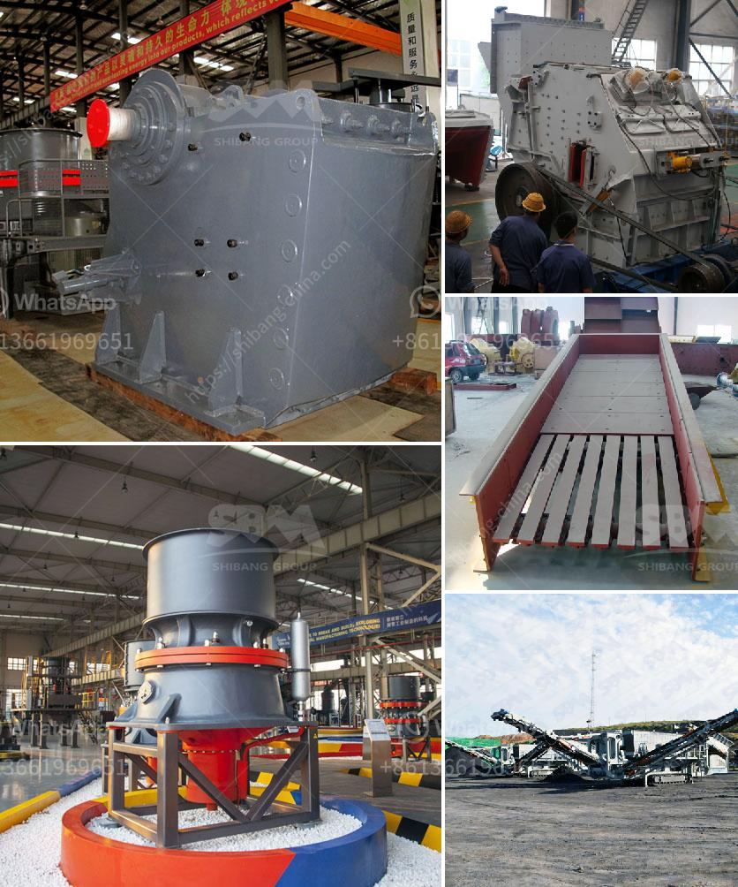

<h3>calcium bromide manufacturing process</h3>
Calcium bromide is a chemical compound that is commonly used in various industries such as oil and gas drilling, pharmaceuticals, and photography. It is a white crystalline solid with the formula CaBr2 and is highly soluble in water. Calcium bromide is produced through a manufacturing process that involves several steps.

The first step in the manufacturing process of calcium bromide involves the extraction of bromine. Bromine is primarily found in the form of brine deposits, also known as salt lakes or salt beds. These brines contain high concentrations of bromide salts, which can be extracted through a process called brine recovery.

The brine recovery process starts with the extraction of raw brine from the salt lakes. The brine is pumped into large evaporation ponds, where it is exposed to sunlight and wind. The heat from the sun and the wind cause the water in the brine to evaporate, leaving behind a concentrated brine solution.

Once the brine has been concentrated, it undergoes a purification process to remove impurities such as calcium and magnesium salts. This purification process typically involves the addition of chemicals such as lime or sodium carbonate, which react with the impurities and form insoluble precipitates. These precipitates can then be filtered out, leaving behind a purified bromide solution.

After purification, the bromide solution is further concentrated through evaporation. The concentrated bromide solution is then subjected to electrolysis, a process that uses an electric current to split the bromide ions into bromine gas and metal ions.

In the case of calcium bromide production, the metal ion is calcium. The calcium ions from the electrolysis process are combined with bromine gas, resulting in the formation of calcium bromide. This reaction is typically carried out in special reactors or vessels equipped with electrodes, where the necessary conditions for the reaction to occur are maintained.

Once the calcium bromide has been produced, it is typically further processed into its desired form. This can involve drying the calcium bromide solution to obtain solid calcium bromide crystals or concentrating the solution to obtain a more concentrated calcium bromide solution.

The final step in the manufacturing process involves packaging and storage of the calcium bromide product. The product is typically packaged in various forms such as solid crystals, liquid solutions, or even as a powder, depending on the intended use.

In conclusion, the manufacturing process of calcium bromide involves the extraction of bromine from brine deposits and the subsequent reaction of the bromine with calcium ions obtained through electrolysis. The process also includes several purification and concentration steps to obtain the desired form of calcium bromide for various applications. Calcium bromide plays a crucial role in various industries and its manufacturing process ensures its availability and usability in these sectors.
<h3>Contact us</h3><ul><li><strong>Whatsapp:&nbsp;<a href="https://wa.me/8613661969651">+8613661969651</a></strong></li><li><a href="https://swt.shibang-china.com/?git&amp;zhl&amp;calcium bromide manufacturing process"><strong>Online Service(chat now)</strong></a></li></ul><h3>Related</h3><ul><li><a href='crusher machine vendor in penang.md'>crusher machine vendor in penang</a></li><li><a href='kenya regular impact crusher.md'>kenya regular impact crusher</a></li><li><a href='how to machine limestone.md'>how to machine limestone</a></li><li><a href='bauxite crusher machine.md'>bauxite crusher machine</a></li><li><a href='pebble crusher manufacturer.md'>pebble crusher manufacturer</a></li></ul>