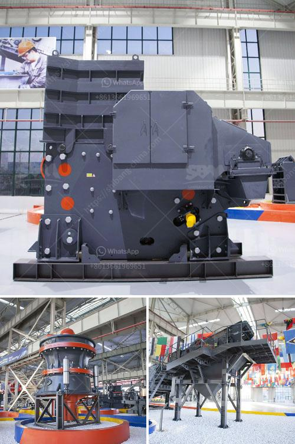

<h3>calcium carbonate crushers</h3>
Calcium carbonate is a common compound found in rocks, shells, and minerals. It is widely used in industries such as cement, ceramics, plastics, and even pharmaceuticals. Calcium carbonate crushers are used to break down the rocks into smaller-sized particles for further processing. Let's explore the importance of these crushers and their role in the calcium carbonate industry.

Firstly, let's understand what calcium carbonate crushers are. These machines are designed to break down rocks into smaller-sized particles. The crushing process begins with the materials being fed into the crusher, either manually or through a conveyor system. The rock is then crushed between two hard surfaces and transformed into smaller particles. These crushers can be further categorized into jaw crushers, impact crushers, and cone crushers, depending on the type of crushing mechanism they use.

Calcium carbonate crushers play a crucial role in the calcium carbonate industry. In fact, calcium carbonate is considered one of the most versatile materials used in various industries. It has a wide range of applications, from construction materials to food additives, and is even used to support animal health. Therefore, the process of breaking down rocks into smaller-sized particles, facilitated by calcium carbonate crushers, is essential for the subsequent processes.

One of the primary applications of calcium carbonate is in the manufacturing of cement. Limestone, a key component of cement, mainly consists of calcium carbonate. The rocks are extracted from quarries and then crushed by crushers to obtain the desired particle size. This finely crushed limestone, in combination with other materials, is then mixed, heated, and ground to form cement. Without calcium carbonate crushers, the entire cement manufacturing process would be hindered.

Apart from cement manufacturing, calcium carbonate crushers are also used in the ceramics industry. The raw materials used in ceramics, such as clay, feldspar, and calcium carbonate, need to be broken down into smaller particles to form a homogeneous mixture. Crushers are used to achieve this particle size reduction, ensuring the uniformity and quality of the ceramic products.

Moreover, the plastic industry also relies on calcium carbonate crushers. Calcium carbonate is commonly used as a filler material in plastics to improve their mechanical properties, reduce production costs, and enhance the environmental friendliness of plastics. The crushers help in reducing the particle size of calcium carbonate, which improves its dispersion within the plastic matrix, resulting in better performance of the final plastic product.

In conclusion, calcium carbonate crushers are crucial machines in various industries, such as cement, ceramics, and plastics. They play a vital role in breaking down the rocks into smaller-sized particles, facilitating the subsequent processes. Without calcium carbonate crushers, the production of materials like cement or ceramics would be severely limited. These crushers enable the efficient usage of calcium carbonate in multiple applications, leading to the development of more sustainable and high-quality products.
<h3>Contact us</h3><ul><li><strong>Whatsapp:&nbsp;<a href="https://wa.me/8613661969651">+8613661969651</a></strong></li><li><a href="https://swt.shibang-china.com/?git&amp;zhl&amp;calcium carbonate crushers"><strong>Online Service(chat now)</strong></a></li></ul><h3>Related</h3><ul><li><a href='gypsum powder price in south africa.md'>gypsum powder price in south africa</a></li><li><a href='river sand and stone mining at sabah.md'>river sand and stone mining at sabah</a></li><li><a href='gypsum mining crusher in kenya manufacturer.md'>gypsum mining crusher in kenya manufacturer</a></li><li><a href='coal powder making machine.md'>coal powder making machine</a></li><li><a href='puzzolana stone crusher 100tph.md'>puzzolana stone crusher 100tph</a></li></ul>