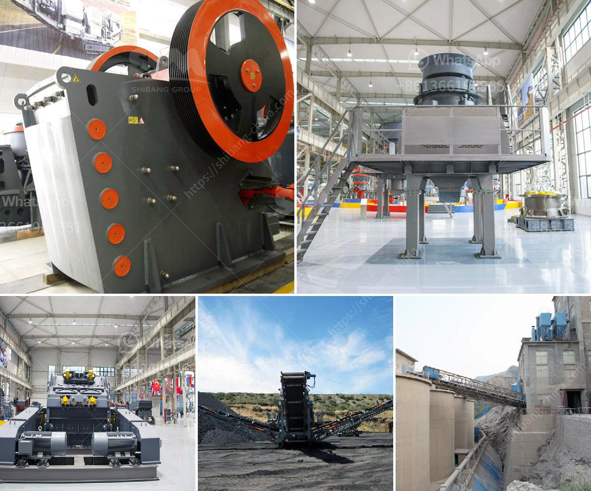

<h3>calcium carbonate crushing machine</h3>
Calcium carbonate is a compound found in many rocks, such as limestone, marble, and chalk. It is processed through a calcium carbonate crushing machine to produce fine and ultrafine powder. The large-sized calcium carbonate rocks are first crushed by a jaw crusher before being fed into the grinding mill to ground into the calcium carbonate powder.

Calcium carbonate crushing machines are also widely used nowadays in industries such as metallurgy, mining, construction, chemical, power, and many others. These machines help to turn big chunks of rocks into small particles that can be used for various purposes.

The calcium carbonate crushing machine works on the principle of impact crushing, and its crushing capacity is determined by the rotor size and speed. But the most important factor that determines the performance of the machine is the crushing chamber design. A well-designed crushing chamber ensures efficient and uniform crushing of calcium carbonate rocks.

Furthermore, the calcium carbonate crushing machine is equipped with a variety of protective devices, such as overload protection, automatic lubrication system, and emergency stop device, to ensure the safety of the operator and the equipment.

In addition to the above features, some calcium carbonate crushing machines are designed with advanced technology, such as hydraulic adjusting system, hydraulic opening cover device, and hydraulic rotation device, which greatly improve the efficiency and convenience of machine operation.

In conclusion, the calcium carbonate crushing machine is an essential part of various industries where large-sized calcium carbonate rocks need to be reduced to smaller particles. These machines are efficient, safe, and equipped with advanced technology, making them reliable and easy to use. If you are looking for a calcium carbonate crushing machine, be sure to check the specifications and features to find the most suitable one for your needs.
<h3>Contact us</h3><ul><li><strong>Whatsapp:&nbsp;<a href="https://wa.me/8613661969651">+8613661969651</a></strong></li><li><a href="https://swt.shibang-china.com/?git&amp;zhl&amp;calcium carbonate crushing machine"><strong>Online Service(chat now)</strong></a></li></ul><h3>Related</h3><ul><li><a href='cobalt concentrate processing equiopment manufacturers.md'>cobalt concentrate processing equiopment manufacturers</a></li><li><a href='ball mill steel balls suppliers in nigeria.md'>ball mill steel balls suppliers in nigeria</a></li><li><a href='slag roller mill.md'>slag roller mill</a></li><li><a href='coal crushing and washing plant sale south africa.md'>coal crushing and washing plant sale south africa</a></li><li><a href='barite crusher machine.md'>barite crusher machine</a></li></ul>