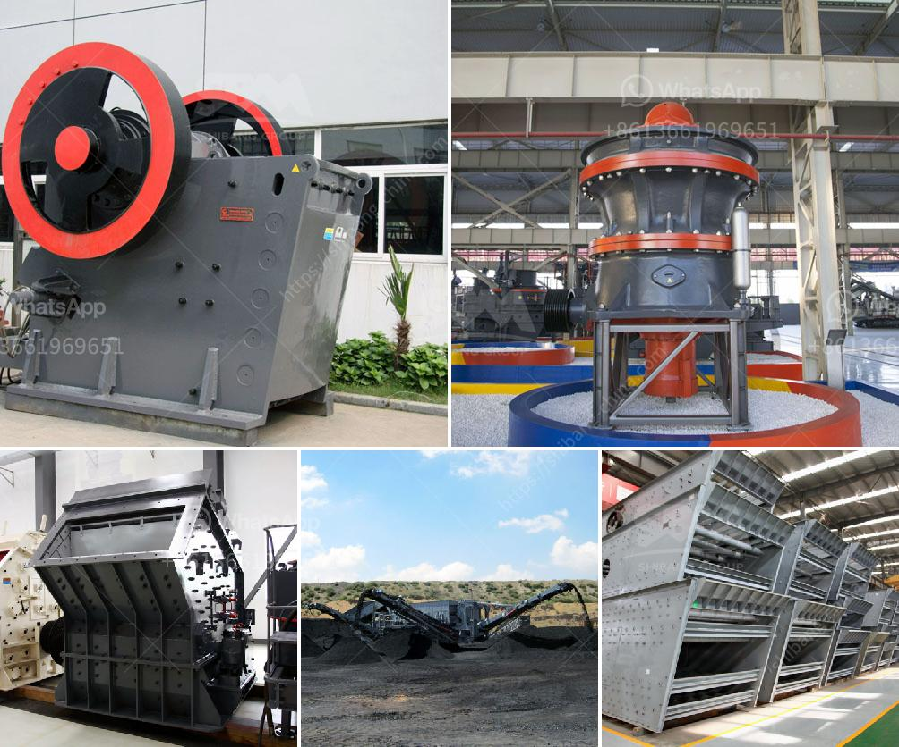

<h3>calcium carbonate factory costs</h3>
Calcium carbonate is a common substance used in various industries, such as construction, paint, plastic, and paper manufacturing. It is an essential component in the production of products like cement, adhesives, toothpaste, and dietary supplements.

Setting up a calcium carbonate factory involves several costs that need to be considered. One of the significant expenses is the machinery and equipment required to extract and process calcium carbonate. This includes crushers, grinders, mixers, conveyors, and packaging machines, among others. The cost of these machines can vary depending on their capacity, quality, and brand.

Another important expense is the cost of securing calcium carbonate reserves or obtaining them through mining. Depending on the location, obtaining the necessary permits and licenses for mining can also add to the overall costs.

In addition to equipment and mining costs, labor expenses should also be accounted for. Operating a calcium carbonate factory involves hiring skilled operators, maintenance staff, and administrative personnel. The wages and benefits for these employees, as well as training and safety measures, should be included in the budget.

Furthermore, it is crucial to consider the energy costs associated with running a calcium carbonate factory. The extraction and processing of calcium carbonate require a significant amount of energy, such as electricity and fuel. Thus, estimating and planning for these expenses is crucial for managing the overall costs effectively.

Other aspects that may contribute to the overall expenditure include transport and logistics costs, raw material storage facilities, waste management systems, and compliance with environmental regulations.

In conclusion, the costs of setting up a calcium carbonate factory can vary depending on several factors. Machinery and equipment, mining or obtaining reserves, labor, energy consumption, and other miscellaneous expenses contribute to the overall cost. Careful planning and budgeting are essential to ensure a smooth and successful establishment of a calcium carbonate factory.
<h3>Contact us</h3><ul><li><strong>Whatsapp:&nbsp;<a href="https://wa.me/8613661969651">+8613661969651</a></strong></li><li><a href="https://swt.shibang-china.com/?git&amp;zhl&amp;calcium carbonate factory costs"><strong>Online Service(chat now)</strong></a></li></ul><h3>Related</h3><ul><li><a href='mining crusher machine.md'>mining crusher machine</a></li><li><a href='application of hammer mill.md'>application of hammer mill</a></li><li><a href='mobile vibrating screen for iron.md'>mobile vibrating screen for iron</a></li><li><a href='dolomite crusher turkey 200 ton price.md'>dolomite crusher turkey 200 ton price</a></li><li><a href='small scale quarry mining equipment.md'>small scale quarry mining equipment</a></li></ul>