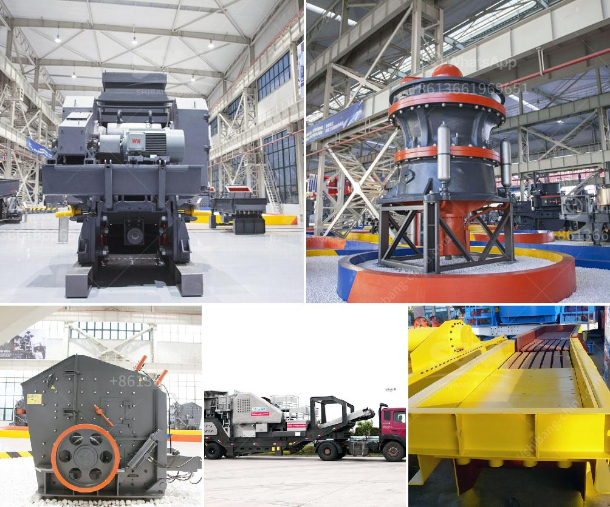

<h3>calcium carbonate machinery</h3>
Calcium carbonate is a naturally occurring compound found in rocks, shells, and pearls. It is the main component of limestone, marble, and chalk. This versatile mineral is widely used in different industries due to its unique properties and wide availability. Calcium carbonate machinery plays a crucial role in processing calcium carbonate powder, which is used in many applications, including plastics, paints, adhesives, paper, and pharmaceuticals.

The process of transforming calcium carbonate from its raw form into a powder involves several steps. One of the crucial pieces of machinery used in this process is a calcium carbonate grinder. This machine grinds calcium carbonate to a fine powder, making it suitable for various applications. The grinder typically consists of a rotating grinding disc that crushes the calcium carbonate particles against a stationary grinding plate. The resulting powder is then collected and packaged for further use.

In addition to grinders, other machinery used in calcium carbonate processing includes crushers, dryers, classifiers, and bagging machines. Crushers are used to break down larger pieces of calcium carbonate into smaller, manageable sizes. Dryers and classifiers help remove moisture and impurities from the calcium carbonate powder, ensuring a high-quality product. Bagging machines efficiently package the final product for distribution and storage.

The use of calcium carbonate machinery is particularly prevalent in the plastics industry. Adding calcium carbonate to plastic formulations enhances their performance and reduces costs. When used as a filler, calcium carbonate improves the mechanical properties of plastics, such as tensile strength, impact resistance, and dimensional stability. It also increases their heat resistance and provides a smooth surface finish. Additionally, calcium carbonate can act as a nucleating agent in the production of polypropylene, aiding in the formation of a crystalline structure and improving the material's stiffness.

Calcium carbonate machinery is also extensively used in the paint industry. Calcium carbonate acts as a pigment extender, enhancing the color strength and opacity of paints, while reducing costs. It also improves paint durability by enhancing its resistance to weathering, aging, and chemical attack. Furthermore, calcium carbonate helps regulate the rheological properties of paint, ensuring proper flow and application.

The paper industry is another major consumer of calcium carbonate machinery. Calcium carbonate is used as a coating pigment and filler in paper production. It improves the brightness, opacity, and printability of paper, allowing for sharper and more vibrant images. The addition of calcium carbonate also increases paper strength and reduces ink absorption, resulting in reduced ink consumption and improved print quality.

The pharmaceutical industry relies on calcium carbonate machinery to produce calcium supplements. Calcium carbonate is a common ingredient in calcium tablets and antacids due to its high calcium content and buffering properties. The machinery ensures that the calcium carbonate used in these products meets the required purity standards and particle size distribution for optimal absorption and efficacy.

In conclusion, calcium carbonate machinery plays a vital role in processing calcium carbonate and enabling its use in various industries. From grinders to crushers and bagging machines, these sophisticated pieces of machinery ensure efficient production and high-quality products. The versatility of calcium carbonate, coupled with its abundance in nature, makes it an essential ingredient in plastics, paints, paper, and pharmaceuticals. As industries continue to grow and technology advances, the demand for calcium carbonate machinery is expected to rise, driving innovation and further optimization of the production process.
<h3>Contact us</h3><ul><li><strong>Whatsapp:&nbsp;<a href="https://wa.me/8613661969651">+8613661969651</a></strong></li><li><a href="https://swt.shibang-china.com/?git&amp;zhl&amp;calcium carbonate machinery"><strong>Online Service(chat now)</strong></a></li></ul><h3>Related</h3><ul><li><a href='crushing and grinding processes of platinum.md'>crushing and grinding processes of platinum</a></li><li><a href='hammer mill indutrial price malaysia.md'>hammer mill indutrial price malaysia</a></li><li><a href='coal mining prices machines.md'>coal mining prices machines</a></li><li><a href='portable gold mining hammer mills.md'>portable gold mining hammer mills</a></li><li><a href='vertical grinder for spindle.md'>vertical grinder for spindle</a></li></ul>