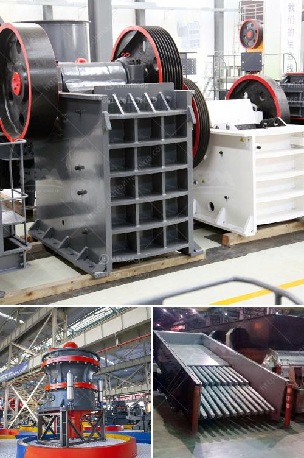

<h3>calcium carbonate manufacturing in egypt</h3>
Calcium carbonate is a widely used mineral compound in various industries. The manufacturing of calcium carbonate is a fascinating process that involves several steps, ranging from quarrying of limestone rocks to the final grinding and packaging of the product.

In Egypt, calcium carbonate manufacturing is done using state-of-the-art machinery, advanced technology, and skilled workers. The country has vast limestone reserves, making it an ideal location for calcium carbonate production.

The process begins with the extraction of limestone from quarries. Limestone is a sedimentary rock composed primarily of calcium carbonate. Large blocks of limestone are excavated from the ground using heavy machinery. These blocks are then transported to the manufacturing facilities.

At the manufacturing facilities, the limestone blocks are crushed into smaller pieces. This is typically done using crushers. The crushed limestone is then further processed to remove impurities. The impurities are separated through a series of screening and washing procedures, ensuring a high purity of calcium carbonate.

Once the impurities have been removed, the calcium carbonate undergoes grinding. Grinding machines are used to reduce the particle size of the calcium carbonate to the desired level. The ground calcium carbonate is then classified based on particle size into various grades.

The final step in the manufacturing process is packaging. The calcium carbonate is carefully packaged into bags or bulk containers, ready for distribution to various industries. The packaging ensures the product's safety and preserves its quality during transportation.

Egypt produces a wide range of calcium carbonate products tailored to meet the specific requirements of different industries. The manufacturing facilities are equipped with advanced technology, allowing for precise control over the product's characteristics. This ensures a consistent quality of calcium carbonate, making it highly sought after by consumers worldwide.

The applications of calcium carbonate are vast and varied. It is commonly used in the construction industry as a raw material for cement, plaster, and concrete. It is also utilized in the manufacturing of ceramics, glass, and paper. Calcium carbonate finds its way into plastics, paints, adhesives, and other industrial products too. Additionally, it is a key ingredient in dietary supplements and pharmaceuticals due to its essential role in promoting bone health.

The calcium carbonate manufacturing industry in Egypt plays a vital role in the country's economy. It generates employment opportunities for skilled workers and contributes to the local communities. The industry also fosters innovation and encourages research and development to improve the product quality and explore new applications.

In conclusion, calcium carbonate manufacturing in Egypt is a well-established industry that relies on top-notch technology, abundant limestone reserves, and skilled workers. The process involves various stages, including quarrying, crushing, grinding, and packaging, to produce high-quality calcium carbonate. The end-product finds application in multiple industries, making it an essential mineral compound globally.
<h3>Contact us</h3><ul><li><strong>Whatsapp:&nbsp;<a href="https://wa.me/8613661969651">+8613661969651</a></strong></li><li><a href="https://swt.shibang-china.com/?git&amp;zhl&amp;calcium carbonate manufacturing in egypt"><strong>Online Service(chat now)</strong></a></li></ul><h3>Related</h3><ul><li><a href='quartz rock processing equipment.md'>quartz rock processing equipment</a></li><li><a href='how to align to horizontal ball mill.md'>how to align to horizontal ball mill</a></li><li><a href='coal washing machines.md'>coal washing machines</a></li><li><a href='stone crusher prices german.md'>stone crusher prices german</a></li><li><a href='manufacturing process of mica crusher.md'>manufacturing process of mica crusher</a></li></ul>