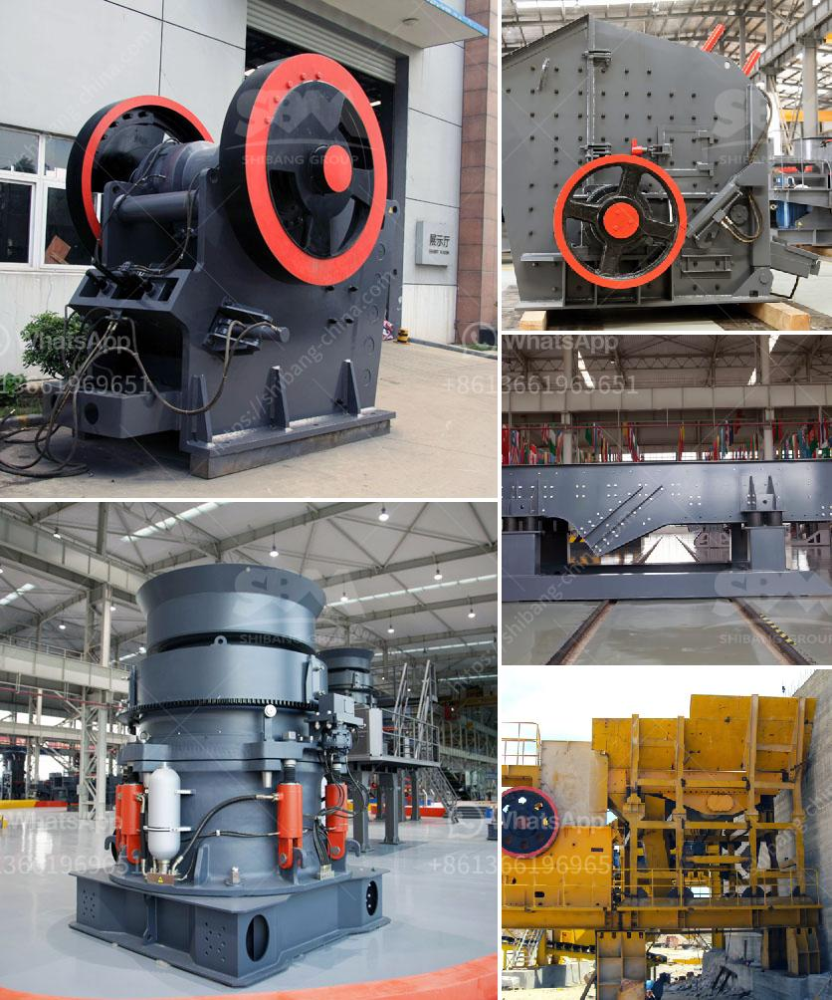

<h3>calcium carbonate milling machine</h3>
Calcium carbonate milling machine is a widely used industrial machine for grinding calcium carbonate into fine powder. With its high efficiency and low cost, calcium carbonate grinding mill is popular in many countries. Here we focus on the introduction of calcium carbonate milling machine in detail.

Calcium carbonate milling machine mainly consists of a main engine, a classifier, a blower, a finished product cyclone collector, a bag filter and a connecting duct. The equipment can be directly crushed and processed into calcium carbonate powder, saving time and energy.

One of the main advantages of calcium carbonate milling machine is its ability to produce uniform particle size distribution. The fineness of the finished product can be adjusted from 325 to 3000 mesh, making it suitable for various industrial applications. The machine also has a wide range of processing materials, such as limestone, calcite, marble, talc, dolomite, barite, kaolin, gypsum, etc.

In terms of operation, calcium carbonate milling machine is easy to operate and maintain. The equipment is equipped with an electrical control system, which can control the feeding speed and adjust the fineness of the finished product. The whole production line has a compact structure, small footprint, and high automation. It can achieve continuous operation without frequent maintenance.

Another advantage of calcium carbonate milling machine is its high production efficiency. The machine adopts advanced grinding principle and multi-head design, which can improve grinding efficiency by 30% to 40% compared with traditional mills. It also has a large production capacity, with a single machine capable of producing 1 to 20 tons of finished products per hour.

In addition, calcium carbonate milling machine is environmentally friendly. The machine is equipped with a pulse dust collector, which can effectively reduce dust pollution in the production process. It also has low noise, low vibration, and less wear and tear on the equipment, ensuring a clean and comfortable working environment.

When selecting a calcium carbonate milling machine, there are several factors to consider. Firstly, the production capacity and fineness requirements should be clarified. This will determine the model of the milling machine. Secondly, the hardness and humidity of the material should be considered, as this will affect the selection of the grinding roller and grinding ring. Lastly, the cost and after-sales service of the equipment should be taken into account.

In conclusion, calcium carbonate milling machine is a versatile and efficient industrial machine. Its ability to produce fine powder with uniform particle size distribution makes it popular in various industries. The machine is easy to operate, maintain, and has high production efficiency. Its environmental-friendly design ensures a clean and comfortable working environment. When selecting a calcium carbonate milling machine, factors such as production capacity, fineness requirements, material characteristics, and cost should be considered.
<h3>Contact us</h3><ul><li><strong>Whatsapp:&nbsp;<a href="https://wa.me/8613661969651">+8613661969651</a></strong></li><li><a href="https://swt.shibang-china.com/?git&amp;zhl&amp;calcium carbonate milling machine"><strong>Online Service(chat now)</strong></a></li></ul><h3>Related</h3><ul><li><a href='powder making machines.md'>powder making machines</a></li><li><a href='jaw crusher pe 500 x 750 price.md'>jaw crusher pe 500 x 750 price</a></li><li><a href='best wash plant for gold mining.md'>best wash plant for gold mining</a></li><li><a href='manufacture of a cone crusher.md'>manufacture of a cone crusher</a></li><li><a href='gypsum processing line.md'>gypsum processing line</a></li></ul>