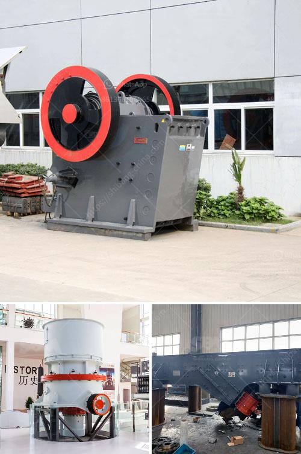

<h3>calcium carbonate mining manufacturer in malaysia</h3>
Malaysia is one of the largest calcium carbonate producers in the world. It boasts a vast amount of quality deposits of limestone and marble, which are the main sources of calcium carbonate in the country. With a population of over 30 million, Malaysia has a strong demand for calcium carbonate products, making it a lucrative market for calcium carbonate mining manufacturers.

One of the leading calcium carbonate mining manufacturers in Malaysia is Calcium Carbonate (M) Sdn Bhd. With a production capacity of 30,000 tons per month, the company has many advanced mining equipment and machineries. They are committed to providing the best calcium carbonate products to their customers, ensuring high quality and consistency.

The company's mining sites are strategically located in the northern region of Malaysia, known for its abundant limestone resources. This allows Calcium Carbonate (M) Sdn Bhd to extract limestone efficiently and cost-effectively, reducing transportation costs and minimizing environmental impact.

The mining process starts with the extraction of limestone from the quarries. The extracted limestone is then processed through crushing, drying, and milling to produce high-quality calcium carbonate powder. The powder is further treated to achieve the desired particle size and purity to meet the diverse needs of industries such as rubber, paint, plastics, and pharmaceuticals.

In addition to producing calcium carbonate powder, Calcium Carbonate (M) Sdn Bhd also offers various grades of calcium carbonate products, including coated and uncoated calcium carbonate. Coated calcium carbonate is widely used in the paper industry as a filler and coating material, enhancing the paper's whiteness, smoothness, and printability.

As a responsible calcium carbonate mining manufacturer, Calcium Carbonate (M) Sdn Bhd prioritizes sustainability and environmental conservation. They have implemented measures to mitigate the impact of their operations on the environment, such as reclamation and recycling programs.

In conclusion, Malaysia is a significant player in the global calcium carbonate market, with abundant limestone and marble resources. Calcium Carbonate (M) Sdn Bhd is a reputable mining manufacturer in Malaysia, meeting the demands of various industries with high-quality calcium carbonate products. With their commitment to sustainability, they are contributing to the responsible development of the calcium carbonate mining industry in Malaysia.
<h3>Contact us</h3><ul><li><strong>Whatsapp:&nbsp;<a href="https://wa.me/8613661969651">+8613661969651</a></strong></li><li><a href="https://swt.shibang-china.com/?git&amp;zhl&amp;calcium carbonate mining manufacturer in malaysia"><strong>Online Service(chat now)</strong></a></li></ul><h3>Related</h3><ul><li><a href='hammer mill pc800 x 600.md'>hammer mill pc800 x 600</a></li><li><a href='crushing plant for sale philippines.md'>crushing plant for sale philippines</a></li><li><a href='marble quarry crusher equipments.md'>marble quarry crusher equipments</a></li><li><a href='companies crushing plant.md'>companies crushing plant</a></li><li><a href='part of roller mill.md'>part of roller mill</a></li></ul>