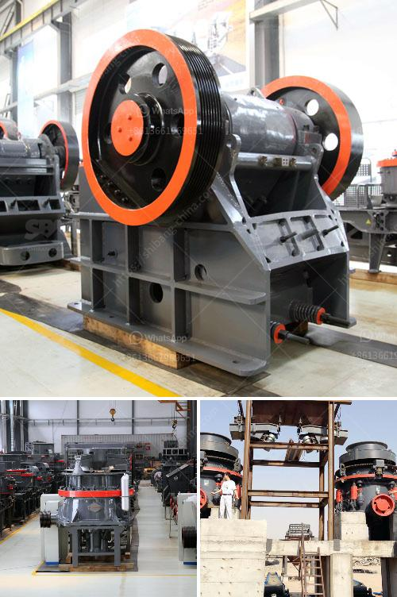

<h3>calcium carbonate plant price</h3>
Calcium carbonate is a widely used industrial mineral that has many applications in various industries, including paper, plastics, paints, coatings, and construction. The demand for calcium carbonate has been steadily increasing over the years, leading to the establishment of numerous calcium carbonate plants worldwide. However, one important consideration for businesses looking to invest in a calcium carbonate plant is the price.

The price of a calcium carbonate plant can vary depending on several factors. These factors not only determine the initial investment required but also the operational costs and profitability of the plant. Here are some key factors to consider when evaluating the price of a calcium carbonate plant.

1. Capacity: The capacity of the plant is a crucial factor in determining the price. Higher capacity plants typically require larger machinery, more raw materials, and a more extensive infrastructure. Consequently, they usually have a higher upfront cost. However, a higher-capacity plant also offers the advantage of economies of scale, leading to lower production costs in the long run.

2. Technology: The technology used in the plant plays a significant role in both the price and the quality of the calcium carbonate produced. Advanced technologies, such as the use of high-quality limestone as a raw material and advanced grinding processes, can result in a higher-quality product. However, these technologies may come at a higher cost.

3. Location: The location of the calcium carbonate plant can affect the price in several ways. First, the availability and cost of raw materials, particularly limestone, can vary depending on the location. Proximity to limestone quarries can reduce transportation costs. Additionally, factors like labor costs, utilities, and regulations can also differ from one location to another, impacting plant price.

4. Environmental Considerations: It is essential to consider environmental factors when evaluating the price of a calcium carbonate plant. Compliance with environmental regulations can increase the upfront costs, as additional equipment and systems may be required for pollution control and waste management. However, investing in environmentally sustainable practices can ensure long-term viability and reputation for the plant.

5. Supplier and Contractor Selection: The choice of suppliers and contractors for various components of the plant, such as machinery, electrical systems, and civil construction, can significantly impact the overall price. It is crucial to select reputable suppliers and contractors to ensure quality and avoid any potential delays or cost overruns.

6. Operation and Maintenance Costs: Apart from the initial investment, it is essential to consider the ongoing operational and maintenance costs of the calcium carbonate plant. These costs include labor, energy consumption, maintenance of machinery, and raw material procurement. Analyzing these costs and projecting the potential revenue from the calcium carbonate production will provide a comprehensive picture of the plant's profitability.

In conclusion, the price of a calcium carbonate plant is influenced by several factors, including capacity, technology, location, environmental considerations, supplier selection, and operation costs. Businesses should carefully evaluate these factors and conduct a cost-benefit analysis before making an investment. Investing in a high-quality and efficient plant can ensure a competitive edge in the growing calcium carbonate market.
<h3>Contact us</h3><ul><li><strong>Whatsapp:&nbsp;<a href="https://wa.me/8613661969651">+8613661969651</a></strong></li><li><a href="https://swt.shibang-china.com/?git&amp;zhl&amp;calcium carbonate plant price"><strong>Online Service(chat now)</strong></a></li></ul><h3>Related</h3><ul><li><a href='fullers earth powder grinding machines in india.md'>fullers earth powder grinding machines in india</a></li><li><a href='sand beneficiation plant technology.md'>sand beneficiation plant technology</a></li><li><a href='spec vibrating screen.md'>spec vibrating screen</a></li><li><a href='quote industrial mill quote ball mills.md'>quote industrial mill quote ball mills</a></li><li><a href='rock crusher quarry.md'>rock crusher quarry</a></li></ul>