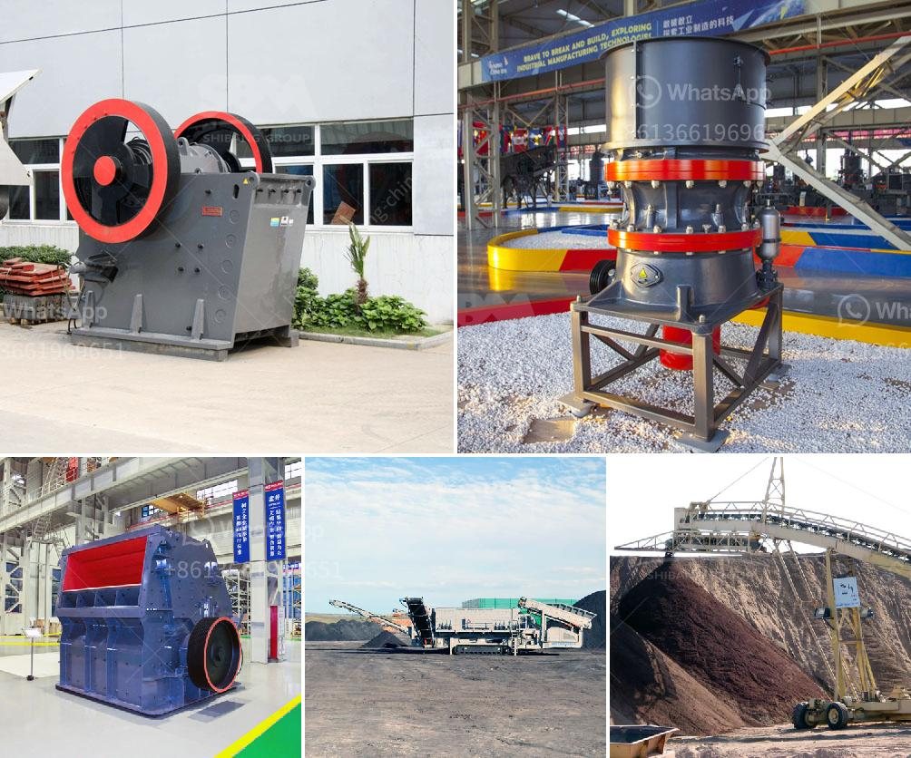

<h3>calcium carbonate proses by process</h3>
Calcium carbonate is a compound that is commonly found in rocks, shells of marine organisms, pearls, and even eggshells. It has a wide range of uses in various industries, including agriculture, construction, and healthcare. The production of calcium carbonate involves several processes to ensure high quality and purity.

The process begins with the extraction of limestone, which is the main source of calcium carbonate. Limestone is obtained from the earth through mining or quarrying. Once extracted, it is crushed into smaller sizes to facilitate further processing.

The next step in the calcium carbonate production process is the calcination of limestone. This involves heating the limestone at a high temperature to remove impurities and convert it into lime. The process usually takes place in a kiln, which can be either vertical or rotary.

During the calcination process, carbon dioxide is released as a byproduct, resulting in the formation of quicklime or burnt lime. Quicklime is a highly reactive substance that can undergo various chemical reactions. It is then cooled and ground into a fine powder, forming calcium oxide.

The final step in the process is the hydration of calcium oxide to produce calcium hydroxide, also known as slaked lime. This reaction involves adding water to the calcium oxide, resulting in a chemical reaction that releases a large amount of heat. The calcium hydroxide is then further refined and purified to remove any impurities.

Once the calcium hydroxide is obtained, it can be used in the production of calcium carbonate. This involves a process called carbonation, where the calcium hydroxide is exposed to carbon dioxide gas under controlled conditions. The carbon dioxide reacts with the calcium hydroxide to form calcium carbonate, which precipitates out of solution.

The precipitated calcium carbonate is then filtered and dried to obtain a fine powder. It can be further processed to obtain different grades of calcium carbonate by adjusting the particle size, surface area, and other properties. This versatility allows calcium carbonate to be used in a wide range of applications.

One of the major advantages of the calcium carbonate production process is its abundance and accessibility. Limestone, the main raw material, is widely available around the world, making calcium carbonate a sustainable and cost-effective option for various industries.

Additionally, calcium carbonate is a versatile compound with numerous uses. In the construction industry, it is used as a filler and extender in paints, coatings, plastics, and concrete. Its high brightness and opacity also make it an ideal ingredient in paper and pulp production.

In agriculture, calcium carbonate is used as a soil conditioner to improve the fertility and structure of the soil. It provides essential nutrients like calcium to plants, promoting healthy growth and development.

Moreover, calcium carbonate is also used in healthcare and pharmaceutical industries. It is a common ingredient in antacids, as it neutralizes stomach acid and provides relief from heartburn and indigestion. It is also used as a dietary supplement to ensure adequate calcium intake for strong bones and teeth.

In conclusion, the production of calcium carbonate involves several processes, including extraction, calcination, hydration, carbonation, and refining. It is a versatile compound with numerous applications in various industries. Its abundance, accessibility, and sustainability make it an attractive option for different sectors. From construction to agriculture and healthcare, calcium carbonate proves to be a valuable and beneficial substance.
<h3>Contact us</h3><ul><li><strong>Whatsapp:&nbsp;<a href="https://wa.me/8613661969651">+8613661969651</a></strong></li><li><a href="https://swt.shibang-china.com/?git&amp;zhl&amp;calcium carbonate proses by process"><strong>Online Service(chat now)</strong></a></li></ul><h3>Related</h3><ul><li><a href='raymond grinding mill manufacturers india.md'>raymond grinding mill manufacturers india</a></li><li><a href='precipitated calcium carbonate production plant design.md'>precipitated calcium carbonate production plant design</a></li><li><a href='hard rock quarry cursher in libya.md'>hard rock quarry cursher in libya</a></li><li><a href='project report for quartz stone plant and quarry.md'>project report for quartz stone plant and quarry</a></li><li><a href='ball mill grinding in malaysia.md'>ball mill grinding in malaysia</a></li></ul>