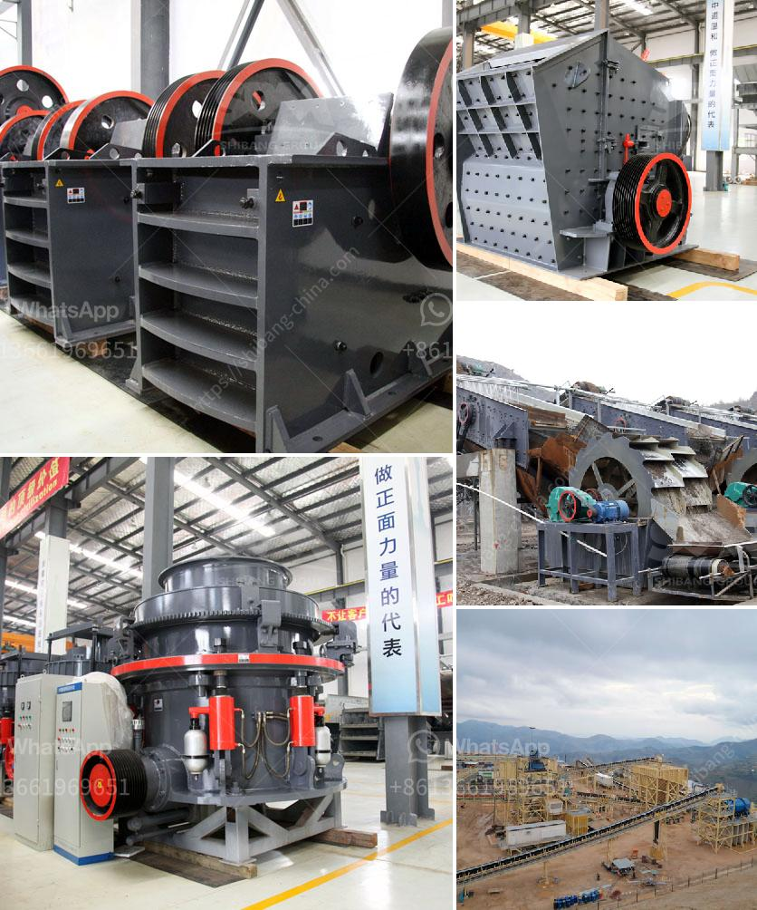

<h3>calcium carbonate pulverizer suppliers</h3>
Calcium carbonate is an essential raw material used in various industries. From agriculture to pharmaceuticals, this versatile compound has a wide range of applications. To obtain calcium carbonate in its pulverized form, a calcium carbonate pulverizer is required.

Pulverizers are used to grind and crush large chunks of calcium carbonate into finer particles. These particles can then be used as fillers in various products or as raw material for further processing. However, finding the right calcium carbonate pulverizer supplier can be a daunting task. In this article, we will discuss the factors to consider when choosing a supplier.

First and foremost, it is important to ensure that the supplier has a good reputation in the industry. Look for suppliers that are well-established and have a track record of providing quality products. You can check online reviews and testimonials to get an idea of their reputation.

Secondly, consider the range of pulverizer models offered by the supplier. A reputable supplier should have a variety of models to choose from, catering to different grinding requirements. Whether you need a small-scale pulverizer for laboratory use or a large-scale one for industrial production, the supplier should be able to provide the right equipment.

Another important factor to consider is the after-sales service provided by the supplier. Buying a pulverizer is a long-term investment, and it is crucial to have reliable technical support. Check if the supplier offers maintenance and repair services, as well as spare parts for their equipment.

Finally, consider the price and overall cost-effectiveness of the equipment. While it may be tempting to go for the cheapest option, it is important to balance cost with quality. Look for suppliers that offer competitive prices without compromising on the quality of their products.

In conclusion, finding the right calcium carbonate pulverizer supplier is crucial to ensure the quality and efficiency of your production process. Take the time to research and compare different suppliers based on their reputation, range of models, after-sales service, and overall cost-effectiveness. By making an informed decision, you can find a reliable supplier that meets your specific needs.
<h3>Contact us</h3><ul><li><strong>Whatsapp:&nbsp;<a href="https://wa.me/8613661969651">+8613661969651</a></strong></li><li><a href="https://swt.shibang-china.com/?git&amp;zhl&amp;calcium carbonate pulverizer suppliers"><strong>Online Service(chat now)</strong></a></li></ul><h3>Related</h3><ul><li><a href='vibrating screen manufacturers in china.md'>vibrating screen manufacturers in china</a></li><li><a href='coal and iron ore mining business plan pdf.md'>coal and iron ore mining business plan pdf</a></li><li><a href='mill gypsum for sale in india.md'>mill gypsum for sale in india</a></li><li><a href='portable concrete crusher rental maryland.md'>portable concrete crusher rental maryland</a></li><li><a href='philippines stone crusher philippines.md'>philippines stone crusher philippines</a></li></ul>