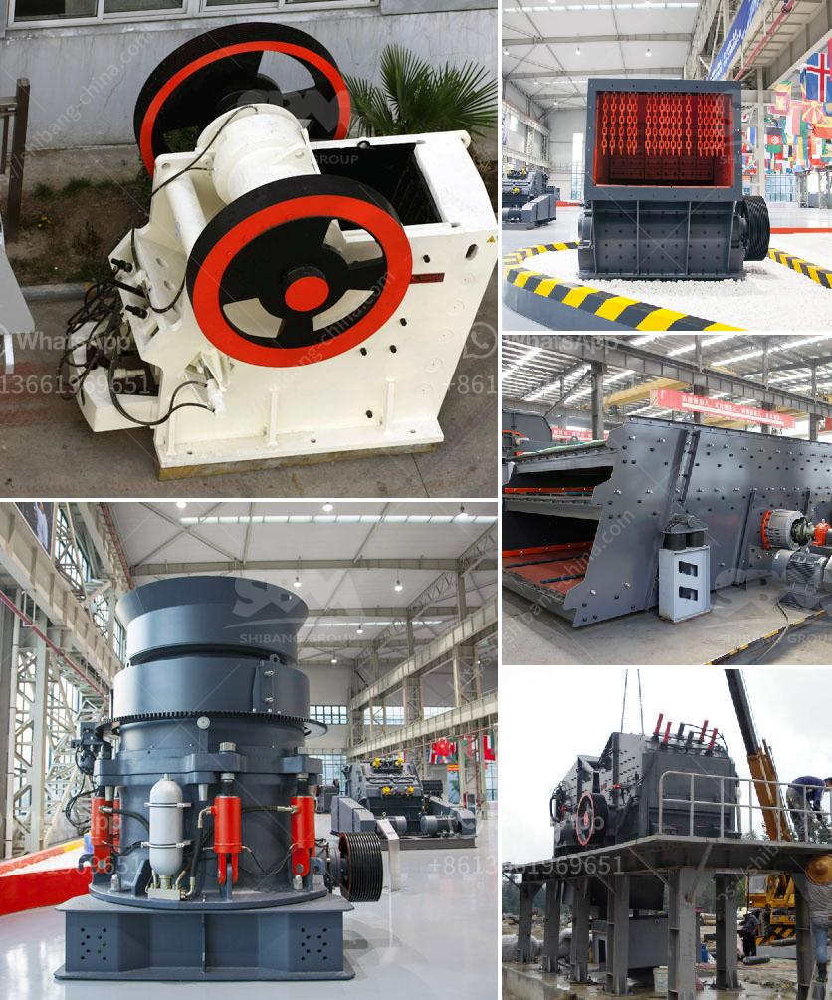

<h3>canada gold mining equipment manufacturers</h3>
Canada is a leading resource-rich country known for its abundance of minerals, including gold. With a long history of gold mining, Canada has emerged as one of the largest producers of gold worldwide. This success can be attributed in part to the innovative and high-quality equipment provided by Canadian gold mining equipment manufacturers.

The Canadian gold mining industry has a strong reputation for being at the forefront of mining technology and equipment innovation. Manufacturers in Canada have a deep understanding of the challenges of mining in the country’s diverse and often harsh landscapes. As a result, they have developed specialized equipment that is robust, efficient, and tailored to the unique demands of gold mining operations in Canada.

One of the leading manufacturers in this industry is Canada Gold Mining Equipment Manufacturers. With decades of experience, they have established themselves as a trusted and reliable supplier, meeting the needs of mining companies across the country. Their equipment ranges from simple, handheld tools to large-scale machinery capable of processing tons of ore per day.

At the heart of their product lineup is their expertise in manufacturing high-quality gold pans, a traditional and essential tool used in gold prospecting. Canada Gold Mining Equipment Manufacturers offers a diverse range of gold pans, including those made from durable materials like steel and aluminum. These pans are carefully designed to provide miners with effective and efficient gold recovery while minimizing environmental impact. This focus on sustainability is vital for maintaining Canada's reputation as a responsible gold producer.

In addition to gold pans, Canada Gold Mining Equipment Manufacturers also produce state-of-the-art dry washers, sluice boxes, and trommels. These larger-scale equipment options are suitable for more extensive mining operations and are designed to recover gold from large quantities of material efficiently. They incorporate advanced technologies such as vibration and gravity separation that maximize gold recovery rates and allow for more accurate and precise processing.

Furthermore, Canada Gold Mining Equipment Manufacturers have invested heavily in research and development to create innovative solutions for gold mining challenges. For example, they have developed specialized equipment for working in frozen or extreme cold environments, facilitating year-round gold extraction in northern regions of the country. This level of ingenuity has positioned Canadian manufacturers as leaders in the global gold mining industry.

Beyond their technical capabilities, Canada Gold Mining Equipment Manufacturers prioritize safety. They understand the risks associated with mining operations and have incorporated safety features into their equipment designs. These features help minimize accidents and injuries, ensuring that miners can carry out their work in a secure environment.

In conclusion, Canadian gold mining equipment manufacturers play a critical role in supporting the country's thriving gold mining industry. The equipment they produce is of exceptional quality and designed to withstand the challenges of Canada's diverse landscapes. From gold pans to large-scale machinery, their products are efficient, effective, and environmentally responsible. With their innovative designs and commitment to safety, Canadian manufacturers are essential partners for gold mining companies in Canada and around the world.
<h3>Contact us</h3><ul><li><strong>Whatsapp:&nbsp;<a href="https://wa.me/8613661969651">+8613661969651</a></strong></li><li><a href="https://swt.shibang-china.com/?git&amp;zhl&amp;canada gold mining equipment manufacturers"><strong>Online Service(chat now)</strong></a></li></ul><h3>Related</h3><ul><li><a href='calcite processing equipment.md'>calcite processing equipment</a></li><li><a href='raymond grinding mill manufacturers in udaipur.md'>raymond grinding mill manufacturers in udaipur</a></li><li><a href='marble crushing plants.md'>marble crushing plants</a></li><li><a href='sand washing machines turkey.md'>sand washing machines turkey</a></li><li><a href='china portable jaw crusher plant manufacturers china.md'>china portable jaw crusher plant manufacturers china</a></li></ul>