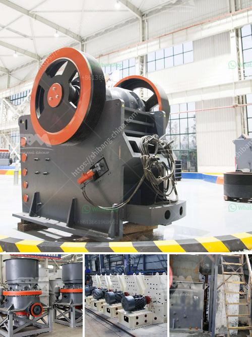

<h3>cara perhitungan hasil produksi stone crusher</h3>
Stone crusher merupakan alat berat yang digunakan untuk menghancurkan batuan besar menjadi batuan kecil atau bahkan menjadi debu batu. Proses penghancuran batuan tersebut merupakan tahap awal untuk mempermudah proses pengolahan batu menjadi material yang siap digunakan dalam berbagai industri, seperti bangunan, jalan raya, dan konstruksi.

Dalam menghitung hasil produksi stone crusher, terdapat beberapa faktor yang harus diperhatikan agar didapatkan hasil yang akurat dan optimal. Berikut adalah cara perhitungan hasil produksi stone crusher yang dapat diikuti:

Kapasitas produksi stone crusher dapat dihitung berdasarkan jumlah batu yang dihancurkan dalam satu jam kerja. Hal ini bergantung pada kapasitas dan kecepatan alat pemecah batu itu sendiri. Untuk menghitung kapasitas produksi, dapat digunakan rumus berikut:

Efisiensi alat dapat dihitung berdasarkan persentase berapa banyak batu yang berhasil dihancurkan dalam satu jam kerja dibandingkan dengan kapasitas maksimal alat tersebut. Persentase ini dapat diperoleh dari data-data produksi per jam yang dilakukan dalam kurun waktu tertentu.

Produksi per jam dapat dihitung dengan mencatat jumlah batu yang dihancurkan dalam satu jam kerja. Data ini bisa diperoleh dari pengamatan terhadap alat pemecah batu selama waktu tertentu atau melalui pencatatan otomatis yang dimiliki oleh mesin tersebut.

Waktu operasi alat stone crusher harus dihitung dengan teliti. Waktu operasi yang akurat akan membantu dalam menghitung produksi per jam dan efisiensi alat tersebut. Waktu operasi dapat dihitung berdasarkan jam kerja alat pemecah batu dalam sehari.

Dalam menghitung hasil produksi stone crusher, perlu diingat bahwa faktor-faktor seperti keausan alat, kondisi batuan yang dihancurkan, serta pengaturan regulasi pada alat juga perlu diperhatikan. Lingkungan kerja yang baik serta pengawasan yang cermat akan membantu mencapai hasil produksi yang optimal.

Penting untuk dicatat, perhitungan hasil produksi stone crusher ini hanya bersifat sebagai estimasi. Hasil produksi yang sebenarnya tersebut perlu dihitung berdasarkan data yang diperoleh dari alat pemecah batu itu sendiri. Oleh karena itu, pengguna alat pemecah batu perlu memiliki bukti pengamatan yang akurat, seperti laporan produksi harian, untuk mendapatkan hasil perhitungan yang lebih tepat.

Dalam industri konstruksi dan pengolahan batu, perhitungan hasil produksi stone crusher merupakan informasi yang diperlukan untuk merencanakan kebutuhan material dan mengevaluasi efisiensi alat. Dengan mengetahui cara perhitungan tersebut, diharapkan pengguna alat dapat melakukan analisis kinerja dan mengoptimalkan hasil produksi sesuai dengan kebutuhan.
<h3>Contact us</h3><ul><li><strong>Whatsapp:&nbsp;<a href="https://wa.me/8613661969651">+8613661969651</a></strong></li><li><a href="https://swt.shibang-china.com/?git&amp;zhl&amp;cara perhitungan hasil produksi stone crusher"><strong>Online Service(chat now)</strong></a></li></ul><h3>Related</h3><ul><li><a href='calcium carbonate crushing machine.md'>calcium carbonate crushing machine</a></li><li><a href='balls in cement grinding.md'>balls in cement grinding</a></li><li><a href='business plan for marble and granite factory pdf.md'>business plan for marble and granite factory pdf</a></li><li><a href='cement plant in india cement plant.md'>cement plant in india cement plant</a></li><li><a href='jaw crusher engine and complete set.md'>jaw crusher engine and complete set</a></li></ul>