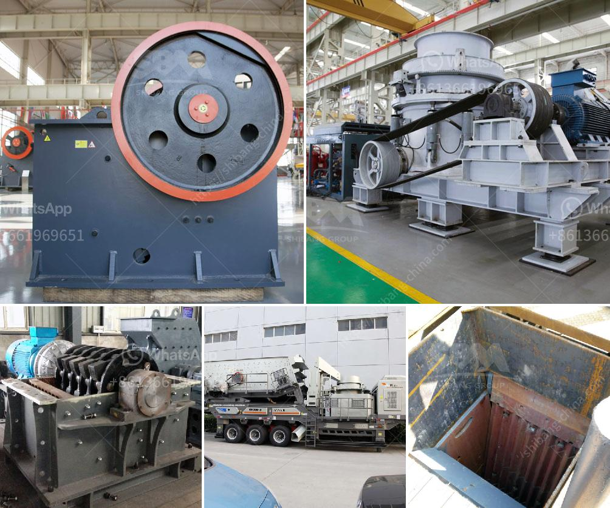

<h3>carbonate from barite manufacturing process</h3>
The manufacturing process of carbonate from barite is an important procedure in the chemical industry. Carbonate from barite refers to the conversion of barite into barium carbonate, a compound that has several applications in various fields. This article will discuss the process involved in transforming barite into carbonate.

The first step in the manufacturing process is the extraction of barite from mines. Barite, a mineral rich in barium sulfate, is typically found in sedimentary rocks and is commonly used in oil drilling fluids. Once the barite is extracted, it undergoes a thorough purification process to remove impurities.

After purification, the barite is then crushed and pulverized into a fine powder. This powdered form of barite is mixed with other chemicals, such as coal, limestone, and sodium carbonate, to facilitate the chemical reaction necessary for the production of carbonate.

Next, the mixture is placed in a furnace and subjected to high temperatures. The intense heat causes a chemical reaction to occur, resulting in the conversion of barite into barium carbonate. This reaction, known as calcination, involves the release of carbon dioxide from the other chemicals and the formation of barium carbonate.

The last step in the manufacturing process is the cooling and solidification of the resulting barium carbonate. Once cooled, the compound is carefully collected and stored for further use. Barium carbonate, due to its unique properties, finds applications in industries like ceramics, glass, and electronics.

In conclusion, the manufacturing process of carbonate from barite is a complex procedure that involves the extraction, purification, pulverization, and chemical reaction of barite. This process is crucial for the production of barium carbonate, a compound widely used in various industries.
<h3>Contact us</h3><ul><li><strong>Whatsapp:&nbsp;<a href="https://wa.me/8613661969651">+8613661969651</a></strong></li><li><a href="https://swt.shibang-china.com/?git&amp;zhl&amp;carbonate from barite manufacturing process"><strong>Online Service(chat now)</strong></a></li></ul><h3>Related</h3><ul><li><a href='recycled glass countertops south africa.md'>recycled glass countertops south africa</a></li><li><a href='cement manufacturing process pdf.md'>cement manufacturing process pdf</a></li><li><a href='stone crusher plant sweden.md'>stone crusher plant sweden</a></li><li><a href='cost of ball mill in india.md'>cost of ball mill in india</a></li><li><a href='cost of cement grinding unit in india.md'>cost of cement grinding unit in india</a></li></ul>