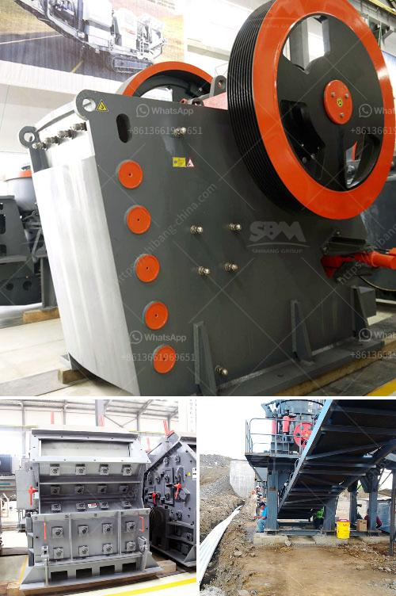

<h3>categories of conveyor belts</h3>
Conveyor belts are an essential component of various industries, facilitating the seamless transportation of goods and materials. These belts are versatile and can be customized to meet specific requirements, making them an indispensable tool for efficient operations. Understanding the different categories of conveyor belts is crucial in selecting the right type for specific applications. In this article, we will explore the various categories of conveyor belts and their distinctive features.

Flat belt conveyors are the most common and widely used type of conveyor belts. They consist of a flat belt that moves materials from one point to another. These belts are ideal for transporting lightweight objects, such as small parts, packages, or food items. Flat belt conveyors can be made from various materials such as rubber, PVC, or fabric, depending on the specific application.

Modular belt conveyors are made up of interlocking modular plastic belts. These belts are highly flexible and can move around corners and uneven surfaces. They are suitable for carrying heavy loads and can withstand harsh environments. Modular belt conveyors find applications in industries such as automotive, packaging, and food processing.

Cleated belt conveyors consist of a continuous belt with raised areas, or cleats, that help in transporting inclined or steeply inclined materials. The cleats prevent the materials from sliding back or falling off the belt. These conveyor belts are commonly used in industries like agriculture, mining, and construction, where the materials being transported are bulky and inclined.

Timing belt conveyors are designed with toothed belts that engage with toothed pulleys for precise control and positioning. They are commonly used in industries that require accurate and synchronized product movement, such as automotive manufacturing, electronics, and pharmaceuticals. Timing belt conveyors ensure that products are moved at specific intervals or in sequence.

Wire mesh conveyors are made by weaving or welding wire mesh belts. These belts allow air circulation and the passage of water or other liquids, making them ideal for industries like food processing and baking. Wire mesh conveyors are also used in industries where high-temperature or heavy-duty applications are involved.

Magnetic belt conveyors use magnetic fields to move materials. These belts are often used in industries like recycling and metalworking, where ferrous materials need to be separated or transported. The magnetic properties of the belt attract and securely hold the materials during transportation.

Troughed belt conveyors consist of a continuous belt that forms a trough to carry bulk materials. The troughed design helps prevent spillage and enables efficient transportation of a large volume of materials. These conveyors are widely used in industries like mining, quarrying, and construction.

In conclusion, conveyor belts are available in various categories, each designed to meet specific industry needs. Flat belt conveyors are versatile and commonly used, while modular belt conveyors offer flexibility. Cleated belt conveyors are suitable for inclined materials, and timing belt conveyors provide precise control. Wire mesh conveyors allow air and liquid passage, magnetic belt conveyors transport ferrous materials, and troughed belt conveyors carry bulk materials efficiently. Selecting the appropriate conveyor belt category is crucial for optimizing productivity and ensuring smooth operations in different industrial settings.
<h3>Contact us</h3><ul><li><strong>Whatsapp:&nbsp;<a href="https://wa.me/8613661969651">+8613661969651</a></strong></li><li><a href="https://swt.shibang-china.com/?git&amp;zhl&amp;categories of conveyor belts"><strong>Online Service(chat now)</strong></a></li></ul><h3>Related</h3><ul><li><a href='zinc ore processing plant.md'>zinc ore processing plant</a></li><li><a href='list of cement plants and their capacities.md'>list of cement plants and their capacities</a></li><li><a href='harga impact crusher.md'>harga impact crusher</a></li><li><a href='lime and dolomite plant in india.md'>lime and dolomite plant in india</a></li><li><a href='ball mill nigeria.md'>ball mill nigeria</a></li></ul>