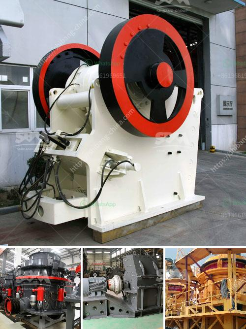

<h3>cde sand wash plant for sale</h3>
If you are in the market for a new sand wash plant, the CDE sand wash plant for sale is worth considering. With its innovative design, advanced technology, and efficient performance, this plant can provide you with a high-quality and cost-effective solution for your sand washing needs.

The CDE sand wash plant is designed to extract maximum value from sand deposits and produce a range of washed sand products to suit various applications. Whether you need coarse sand for construction purposes or fine sand for concrete production, this plant can cater to your requirements.

One of the standout features of the CDE sand wash plant is its modular design. The plant can be easily assembled and disassembled, making it highly portable and flexible. This means that you can transport and set up the plant at different sites, allowing you to access various sand deposits without the need for expensive infrastructure.

Another key advantage of the CDE sand wash plant is its efficient operation. The plant utilizes a combination of screening, washing, and dewatering processes to remove impurities from the sand and produce clean and high-quality end products. By effectively separating silt, clay, and other contaminants from the sand, this plant ensures that the final product meets the required specifications and is ready for use in various applications.

Moreover, the CDE sand wash plant incorporates advanced technology to optimize its performance and reduce operating costs. The plant is equipped with intelligent control systems and sensors that monitor and adjust the washing process in real time. This ensures that the plant operates at its peak efficiency, minimizing water and energy consumption while maximizing sand recovery.

In addition to its efficiency and performance, the CDE sand wash plant is also designed with user-friendliness in mind. The plant features a user-friendly interface, allowing operators to easily control and monitor the washing process. The plant is also equipped with safety features and maintenance-friendly components, ensuring that it can be operated and maintained with ease.

Furthermore, the CDE sand wash plant is built to withstand the harshest operating conditions. The plant is constructed with robust materials and components, ensuring its durability and longevity. This means that you can rely on this plant to deliver consistent and reliable performance, even in demanding environments.

In conclusion, if you are in need of a sand wash plant, the CDE sand wash plant for sale is a great investment. With its modular design, efficient operation, advanced technology, and user-friendly features, this plant offers a cost-effective solution for your sand washing needs. Whether you are in the construction, concrete, or other industries, this plant can provide you with high-quality washed sand products to meet your specific requirements. So, don't miss out on the opportunity to enhance your sand washing process with the CDE sand wash plant.
<h3>Contact us</h3><ul><li><strong>Whatsapp:&nbsp;<a href="https://wa.me/8613661969651">+8613661969651</a></strong></li><li><a href="https://swt.shibang-china.com/?git&amp;zhl&amp;cde sand wash plant for sale"><strong>Online Service(chat now)</strong></a></li></ul><h3>Related</h3><ul><li><a href='quotation ball mill.md'>quotation ball mill</a></li><li><a href='slag crushing plant.md'>slag crushing plant</a></li><li><a href='ball mill ball portable.md'>ball mill ball portable</a></li><li><a href='gold mining equipment manufacturer china.md'>gold mining equipment manufacturer china</a></li><li><a href='calcining machine for gypsum factory from taiwan.md'>calcining machine for gypsum factory from taiwan</a></li></ul>