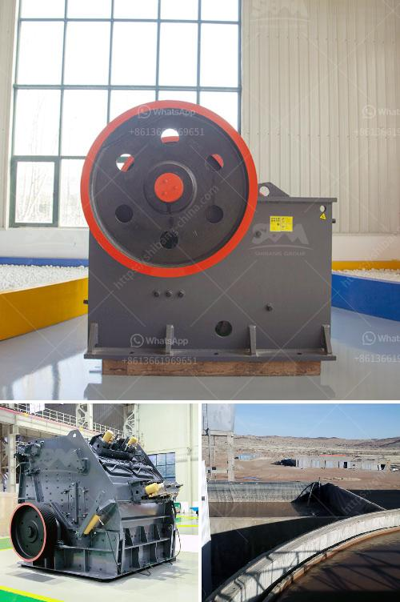

<h3>cebu rock crusher</h3>
Cebu, one of the provinces in the Philippines, offers a wide range of choices for constructing homes, buildings, and infrastructures. One such option is the purchase of a rock crusher with capacities ranging from 300-500 tons per hour.

Quarrying activities in Cebu are being conducted in various locations. At present, there are more than 20 active quarry sites in the province. These sites are crucial in supplying raw materials needed for construction projects. And in this bustling industry, a rock crusher plays an essential role in turning huge stones into smaller, more manageable sizes.

A rock crusher is a machine that reduces the size of rocks through crushing processes. It is commonly used in construction waste recycling, mining, and quarrying. But regardless of the application, customers can choose from various devices to suit their needs. Some types of rock crushers commonly used in Cebu include jaw crushers, cone crushers, gyratory crushers, and impact crushers.

Jaw crushers are commonly used as primary crushers and can handle materials with a compressive strength of up to 320MPa. They are designed to crush large rocks into smaller pieces for further processing. Cone crushers, on the other hand, are ideal for secondary and tertiary crushing. They operate by compressing the material between an eccentrically rotating mantle and a concave hopper, thereby creating finer particles.

Gyratory crushers are similar to cone crushers, but they have a different design. They consist of a concave surface and a conical head. The material is fed into the space between the two surfaces, and when it is crushed, it exits through the bottom. Impact crushers, on the other hand, use impact force to crush the material. They are ideal for crushing softer materials like limestone or concrete.

When selecting a rock crusher, one must consider factors such as the type of material to be crushed and the required output size. Additionally, it is crucial to evaluate the machine's power and efficiency. For instance, a 300-500 tons per hour rock crusher should have a motor with around 200-300 kilowatts of power. Efficiency will impact not only the production capacity but also the energy consumption and operational costs.

In Cebu, rock crushers are widely used in the quarrying industry and construction projects. Many construction companies choose to invest in a bigger rock crusher, typically with a capacity ranging from 300 to 500 tons per hour. Such large-capacity machines are perfect for tough materials like granite, basalt, and limestone. With a rock crusher of this size, construction companies can effectively produce crushed stones for roads, railways, and various construction applications.

To summarize, a rock crusher is an essential piece of equipment used in the construction and quarrying industries in Cebu. It is vital for breaking down large rocks into smaller, more manageable sizes. Depending on the application and desired output, customers can choose from various types of crushers, such as jaw crushers, cone crushers, gyratory crushers, and impact crushers. Investing in a rock crusher with a capacity of 300-500 tons per hour can greatly improve productivity and efficiency in construction and quarrying operations in Cebu.
<h3>Contact us</h3><ul><li><strong>Whatsapp:&nbsp;<a href="https://wa.me/8613661969651">+8613661969651</a></strong></li><li><a href="https://swt.shibang-china.com/?git&amp;zhl&amp;cebu rock crusher"><strong>Online Service(chat now)</strong></a></li></ul><h3>Related</h3><ul><li><a href='stone crush machine price in pakistan.md'>stone crush machine price in pakistan</a></li><li><a href='size of ball mill with cspacity 280 tph.md'>size of ball mill with cspacity 280 tph</a></li><li><a href='sand and gravel dryer equipment qatar.md'>sand and gravel dryer equipment qatar</a></li><li><a href='how to start a stone crusher business.md'>how to start a stone crusher business</a></li><li><a href='mineral industrial crushers.md'>mineral industrial crushers</a></li></ul>