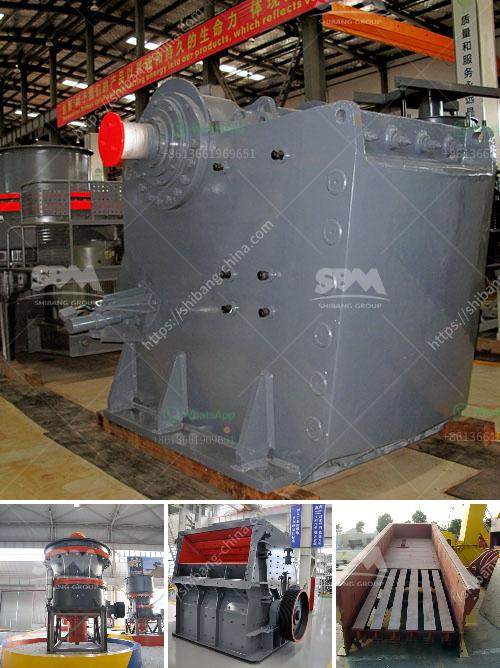

<h3>celestine ball milling process supplier</h3>
In the world of industrial manufacturing, the process of ball milling plays a crucial role in enhancing material quality. With the ability to break down and refine materials into smaller particles, ball milling has become a widely used technique across various industries. In this article, we will explore the significance of the Celestine Ball Milling Process Supplier and how they contribute to improving material quality.

The Celestine Ball Milling Process Supplier refers to a company or entity that provides the necessary equipment, materials, and expertise to carry out the ball milling process effectively. One of the leading suppliers in this field is known for their advanced technology, high-quality milling equipment, and excellent customer service.

One of the primary advantages of choosing a renowned Celestine Ball Milling Process Supplier is the access to state-of-the-art equipment. These suppliers invest heavily in research and development to create cutting-edge solutions for their customers. Their ball milling machines are designed to provide precise control over the milling process, ensuring consistent results and high-quality output.

Furthermore, the Celestine Ball Milling Process Supplier also offers a wide range of materials suitable for milling. They understand that different industries demand different material properties, and thus provide a diverse selection of materials to cater to individual needs. This allows manufacturers to choose the most suitable material for their specific applications, optimizing the final product's performance.

Moreover, the expertise and guidance provided by the Celestine Ball Milling Process Supplier are invaluable. They have a team of skilled professionals who are well-versed in the intricacies of ball milling. These experts work closely with manufacturers to understand their requirements and offer tailored solutions. They provide assistance throughout the process, from material selection and milling parameters to troubleshooting and quality control.

One of the primary applications of ball milling is the production of nanomaterials. Nanomaterials exhibit unique properties and find applications in various fields, including electronics, healthcare, and energy storage. The Celestine Ball Milling Process Supplier understands the importance of nanomaterials and offers specialized milling techniques to produce them. Their expertise enables manufacturers to create precise, uniform nanoparticles with excellent purity and dispersion.

Another advantage of utilizing reputable Celestine Ball Milling Process Suppliers is their commitment to quality control. They implement rigorous quality assurance measures to ensure the materials produced meet the highest standards. This includes thorough testing, analysis, and certification of the milled products, providing manufacturers with confidence in the material's performance and reliability.

In conclusion, the Celestine Ball Milling Process Supplier plays a crucial role in enhancing material quality in various industries. Their cutting-edge equipment, diverse material selection, expert guidance, and commitment to quality control contribute to the optimization of the ball milling process. By partnering with a renowned supplier, manufacturers can achieve consistent, high-quality output and unlock the full potential of their materials.
<h3>Contact us</h3><ul><li><strong>Whatsapp:&nbsp;<a href="https://wa.me/8613661969651">+8613661969651</a></strong></li><li><a href="https://swt.shibang-china.com/?git&amp;zhl&amp;celestine ball milling process supplier"><strong>Online Service(chat now)</strong></a></li></ul><h3>Related</h3><ul><li><a href='galena crushing and processing.md'>galena crushing and processing</a></li><li><a href='vertical grinder mill machine.md'>vertical grinder mill machine</a></li><li><a href='how to machine limestone.md'>how to machine limestone</a></li><li><a href='bison 120 crusher for sale.md'>bison 120 crusher for sale</a></li><li><a href='cocount crushing manchine.md'>cocount crushing manchine</a></li></ul>