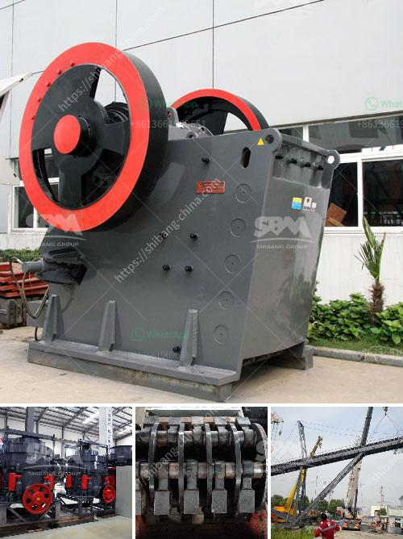

<h3>cement clinker grinding equipmenttpd</h3>
Cement clinker grinding equipment plays an important role in cement production line. It is the main equipment for clinker grinding in cement plants, and its function is to grind clinker and gypsum to ensure the appropriate particle size of cement.

Cement clinker grinding equipmenttpd is a complete set of equipment used to grind cement clinker and gypsum in cement plants. The main equipment includes cement ball mill, roller press, and vertical cement mill. Each of these machines has its own characteristics, which can be selected according to the actual needs of the project.

The cement ball mill is mainly used for grinding cement clinker. It is the key equipment for regrinding after the cement clinker has been crushed. The cement ball mill is widely used in cement, silicate products, new building materials, refractory materials, fertilizers, black and non-ferrous metal dressings, and glass ceramics.

The roller press is a new type of cement grinding equipment. It has the characteristics of high efficiency, energy saving, and low cost. Compared with the traditional cement ball mill, the roller press consumes less power and generates less dust. It is especially suitable for grinding cement clinker with high moisture content.

The vertical cement mill is also called vertical roller mill. It is mainly used for grinding cement clinker. The vertical cement mill adopts an integrated grinding system, which integrates drying, grinding, and powder selection. It has the characteristics of high grinding efficiency, large drying capacity, low energy consumption, and low noise.

In addition to the above three types of equipment, there are other auxiliary machines in the cement clinker grinding equipmenttpd, such as dust collectors, crushers, bucket elevators, and electromagnetic vibrating feeders. These auxiliary machines are necessary to ensure the smooth operation and high efficiency of the cement grinding process.

The cement clinker grinding equipmenttpd can greatly improve the production efficiency of cement plants and reduce energy consumption. With the continuous development of cement technology and the increasing demand for cement in the construction industry, the market demand for cement clinker grinding equipment is also increasing.

In summary, cement clinker grinding equipmenttpd is an indispensable equipment in cement production line. It can grind cement clinker and gypsum to the appropriate particle size, ensuring the quality and fineness of cement. With the continuous improvement of technology, the cement clinker grinding equipmenttpd will become more efficient and energy-saving, contributing to the sustainable development of the cement industry.
<h3>Contact us</h3><ul><li><strong>Whatsapp:&nbsp;<a href="https://wa.me/8613661969651">+8613661969651</a></strong></li><li><a href="https://swt.shibang-china.com/?git&amp;zhl&amp;cement clinker grinding equipmenttpd"><strong>Online Service(chat now)</strong></a></li></ul><h3>Related</h3><ul><li><a href='stone crushing machines in uk.md'>stone crushing machines in uk</a></li><li><a href='coal powder making machine.md'>coal powder making machine</a></li><li><a href='cara perhitungan hasil produksi stone crusher.md'>cara perhitungan hasil produksi stone crusher</a></li><li><a href='grinding roller mill.md'>grinding roller mill</a></li><li><a href='300 tone per hour limestone crusher.md'>300 tone per hour limestone crusher</a></li></ul>