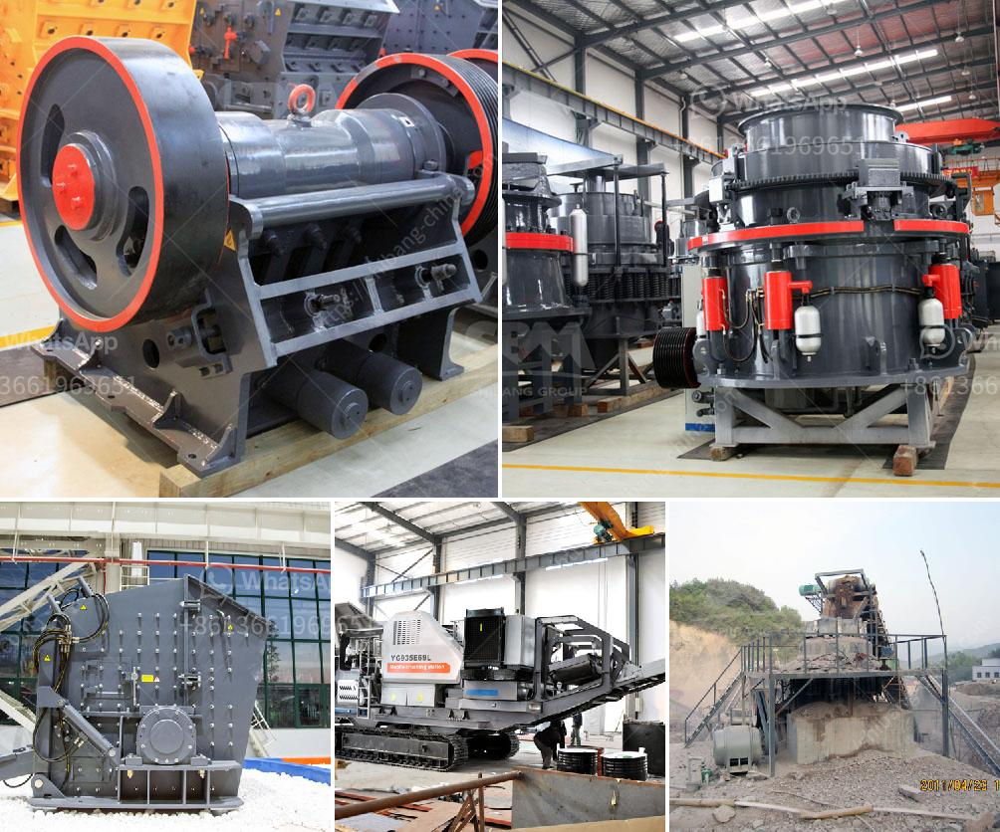

<h3>cement clinker grinding manufacturer</h3>
Cement is one of the key components in construction projects, serving as the foundation for modern infrastructure development. To produce high-quality cement, a crucial step involves grinding the raw materials, such as limestone, clay, and iron ores, into a fine powder called cement clinker. This is where cement clinker grinding manufacturers play a vital role in the cement manufacturing process.

Cement clinker grinding manufacturers are specialized companies that provide machinery, equipment, and expertise necessary for the grinding of these raw materials. They ensure the production of finely powdered cement clinker, which is then mixed with gypsum and other additives to upsurge the cement's properties.

One prominent cement clinker grinding manufacturer known for its exceptional offerings and track record is XYZ Industries. With years of experience and advanced technology, XYZ Industries has distinguished itself as a reliable and efficient provider in the industry.

The primary objective of cement clinker grinding manufacturers is to guarantee efficient and sustainable production processes that adhere to strict environmental standards. XYZ Industries achieves this by employing grinding machines that are energy-efficient and environmentally friendly. These machines reduce energy consumption while maintaining high-quality cement clinker production.

Moreover, XYZ Industries focuses on constant research and innovation to improve its grinding machinery. It works towards integrating the latest technological advancements, such as automated controls and precise monitoring systems, to optimize the grinding process. Furthermore, the company understands the importance of sustainability and ensures that its machines have minimal carbon footprints, reducing the impact on the environment.

In addition to technological advancements, XYZ Industries also emphasizes the importance of safety and worker welfare. The company boasts state-of-the-art safety features in its grinding equipment, ensuring a safe working environment for its employees. This commitment to the welfare of its workers has made XYZ Industries one of the preferred choices among industry professionals.

Furthermore, cement clinker grinding manufacturers like XYZ Industries support the notion of sustainable infrastructure development. By providing efficient and reliable grinding machinery, they contribute to the production of high-quality cement that can withstand harsh environmental conditions, increasing the longevity of infrastructure projects. This commitment to sustainability helps create a greener and more eco-friendly construction industry.

In conclusion, cement clinker grinding manufacturers, such as XYZ Industries, play a critical role in the cement manufacturing process. Their expertise and machinery ensure the production of finely powdered cement clinker, necessary for producing high-quality cement. By focusing on energy efficiency, environmental sustainability, and worker welfare, these manufacturers contribute to the development of sustainable infrastructure. With their constant research and innovation, they continue to revolutionize the cement industry, pushing it towards a greener and more sustainable future.
<h3>Contact us</h3><ul><li><strong>Whatsapp:&nbsp;<a href="https://wa.me/8613661969651">+8613661969651</a></strong></li><li><a href="https://swt.shibang-china.com/?git&amp;zhl&amp;cement clinker grinding manufacturer"><strong>Online Service(chat now)</strong></a></li></ul><h3>Related</h3><ul><li><a href='tata voltas stone crusher.md'>tata voltas stone crusher</a></li><li><a href='dolomite crusher turkey 200 ton price.md'>dolomite crusher turkey 200 ton price</a></li><li><a href='to calculate cost of limestone production in mining.md'>to calculate cost of limestone production in mining</a></li><li><a href='pebble crushing equipment.md'>pebble crushing equipment</a></li><li><a href='ball mill equipment 150 tons hr.md'>ball mill equipment 150 tons hr</a></li></ul>