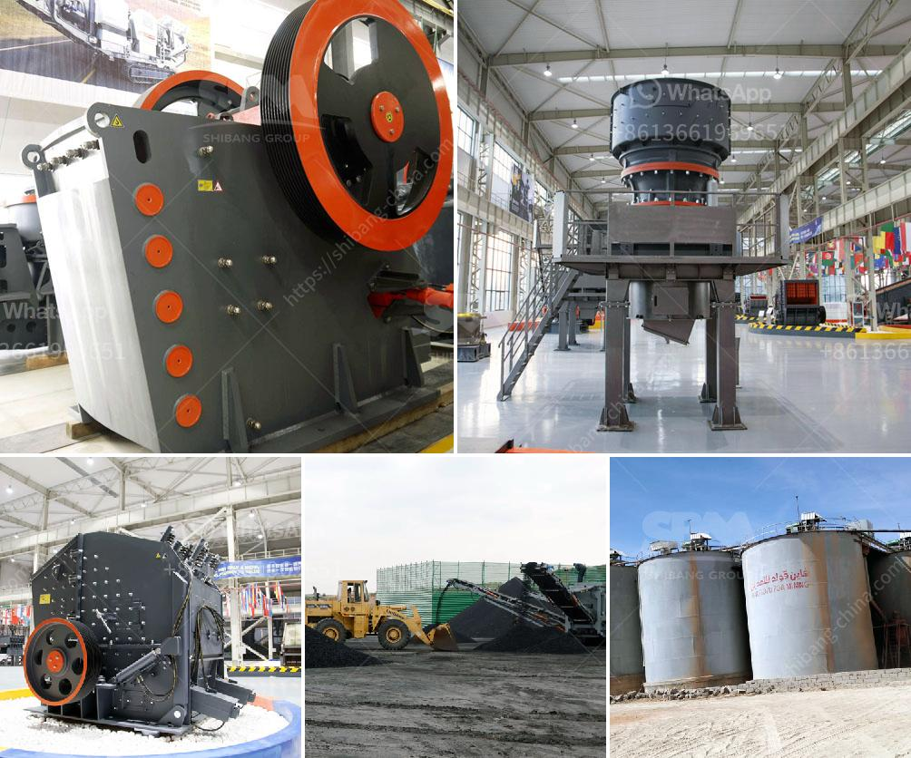

<h3>cement clinker grinding plant for sale in india</h3>
Cement production in India is growing at a brisk pace. As we all know, India is the second-largest producer of cement in the world, after China. With the government's push for infrastructure development and affordable housing, the demand for cement is expected to further increase in the coming years. This has led to a rise in the establishment of cement clinker grinding plants across the country.

Cement clinker grinding plants are vital to the Indian construction industry. The industry is playing a significant role in the economic growth of the country, as it produces large quantities of cement that are used for various construction activities, such as building homes, bridges, roads, and highways.

1. Raw material process: In this process, the limestone and clay are finely ground into a powder, which is then mixed and heated in a kiln to form clinker, the intermediate product in cement manufacturing.

2. Clinker grinding process: The clinker is transported to the cement mill, where it is ground into a fine powder. This powder is then used to produce cement.

3. Cement packing and shipping process: The finished cement is packed and shipped to the customers. The packaging process ensures that the cement remains dry and free from moisture, which is essential for maintaining its quality.

There are several advantages of setting up a cement clinker grinding plant in India. Firstly, the location of such plants near a limestone quarry ensures abundant availability of raw materials. This reduces transportation costs, which, in turn, lowers the overall production cost.

Secondly, the establishment of these plants creates job opportunities for the local population. The cement industry is known to provide both direct and indirect employment to millions of people across the country. This contributes to poverty reduction and improves the standard of living in the surrounding areas.

Furthermore, cement clinker grinding plants help in reducing the carbon footprint. The manufacturing process of cement produces a significant amount of carbon dioxide, a greenhouse gas responsible for global warming. By adopting modern technologies and implementing efficient production processes, these plants can minimize their environmental impact.

In conclusion, the cement clinker grinding plant for sale in India is a highly profitable investment opportunity. With the growing demand for cement, coupled with declining availability of quality limestone and coal reserves, it is an ideal time for entrepreneurs to capitalise on this thriving industry. By setting up their own plants, they can not only meet the local demand but also export cement to other countries, thereby contributing to the country's economic growth.
<h3>Contact us</h3><ul><li><strong>Whatsapp:&nbsp;<a href="https://wa.me/8613661969651">+8613661969651</a></strong></li><li><a href="https://swt.shibang-china.com/?git&amp;zhl&amp;cement clinker grinding plant for sale in india"><strong>Online Service(chat now)</strong></a></li></ul><h3>Related</h3><ul><li><a href='cost of crushed concrete.md'>cost of crushed concrete</a></li><li><a href='cost of mini pulvrizers crusher.md'>cost of mini pulvrizers crusher</a></li><li><a href='lime and dolomite plant in india.md'>lime and dolomite plant in india</a></li><li><a href='drums of conveyor belts malaysia.md'>drums of conveyor belts malaysia</a></li><li><a href='crushing plant in maule.md'>crushing plant in maule</a></li></ul>