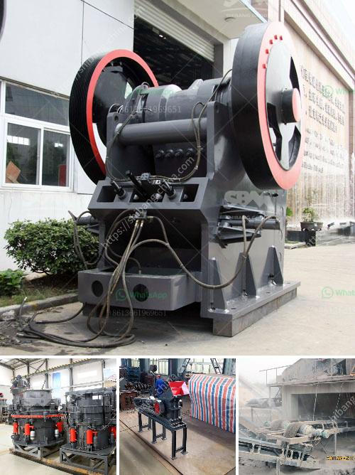

<h3>cement clinker mill suppliers in turkey</h3>
Turkey is known for its rich cultural heritage and historical landmarks, but it is also a prominent player in the global cement industry. The country boasts a vast supply of natural resources, including limestone and clay, which are crucial ingredients for cement production. As a result, there is a thriving market for cement clinker mill suppliers in Turkey.

Cement clinker mills are used in the final stage of the cement production process. They grind and pulverize clinker, a material produced by heating limestone and clay, into a fine powder, which is then used as a binder in concrete. These mills are essential in ensuring the quality and consistency of the final cement product.

When it comes to cement clinker mill suppliers, Turkey has a wide range of options to choose from. The country is home to several renowned manufacturers, who have years of experience and expertise in this field. These suppliers not only provide high-quality mills but also offer comprehensive after-sales support and service.

One of the leading cement clinker mill suppliers in Turkey is XYZ Company. With over two decades of experience in the industry, XYZ Company has established a strong reputation for delivering innovative and reliable solutions. Their mills are designed to handle different capacities and can be customized to meet specific requirements.

Another prominent supplier is ABC Industries, a company known for its cutting-edge technology and commitment to sustainability. Their mills are energy-efficient and have a low environmental impact, making them an ideal choice for companies looking to reduce their carbon footprint.

In addition to these key players, there are several other cement clinker mill suppliers in Turkey that offer competitive pricing and a wide range of products. This healthy competition ensures that customers have ample choices and can find the best option to suit their needs.

Overall, Turkey's cement industry continues to thrive, thanks to its abundant resources and a robust network of suppliers. Cement clinker mill suppliers in the country play a crucial role in supporting this industry by providing high-quality mills that contribute to the production of superior cement products. With their expertise and commitment to innovation, these suppliers are driving the growth and success of Turkey's cement sector.
<h3>Contact us</h3><ul><li><strong>Whatsapp:&nbsp;<a href="https://wa.me/8613661969651">+8613661969651</a></strong></li><li><a href="https://swt.shibang-china.com/?git&amp;zhl&amp;cement clinker mill suppliers in turkey"><strong>Online Service(chat now)</strong></a></li></ul><h3>Related</h3><ul><li><a href='crushers for sale in.md'>crushers for sale in</a></li><li><a href='small feldspar grinding milling plant in nigeria.md'>small feldspar grinding milling plant in nigeria</a></li><li><a href='jaw crusher price in kenya.md'>jaw crusher price in kenya</a></li><li><a href='modular conveyor belt supplier china.md'>modular conveyor belt supplier china</a></li><li><a href='stone crusher zenith.md'>stone crusher zenith</a></li></ul>