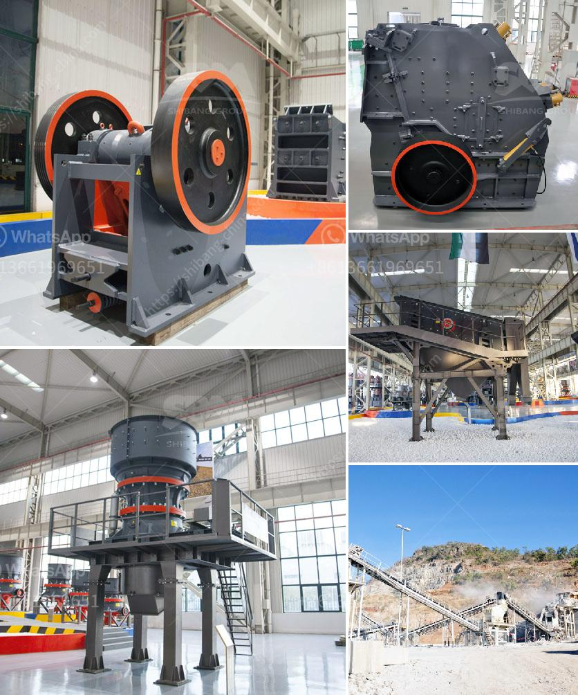

<h3>cement grinding mill in bangladesh</h3>
Cement is one of the most essential materials for infrastructure development. It is a key ingredient in the construction industry, and its demand is ever-growing in Bangladesh. With the rapid growth of the country's economy and infrastructure, there is a significant need for high-quality cement to meet the demands of construction projects.

In Bangladesh, several cement manufacturers are competing to provide the best quality cement to the construction industry. One essential equipment in the cement manufacturing process is the cement grinding mill. It is mainly used to grind the clinker and raw materials in cement plants, and also can be applied in metallurgy, chemical, electric power, and other industries to grind all kinds of ores.

The cement grinding mill in Bangladesh is equipped with advanced technology, such as drying, grinding, and powder selection. The entire system is compact and adopts a modular design, which is convenient for transportation and installation. It has a large output, low energy consumption, and a high grinding efficiency. The grinding media in the mill is made of high-quality materials, which have high wear resistance and long service life, ensuring the stable operation of the equipment.

Furthermore, the cement grinding mill in Bangladesh is environmentally friendly. It adopts a pulse dust collector to capture dust during the grinding process, effectively reducing the pollution to the environment. The advanced technology in the mill also enables the reduction of energy consumption, contributing to a sustainable future.

Moreover, the cement grinding mill in Bangladesh offers various options for cement production, such as continuous grinding, semi-finished grinding, and finished grinding. It can be customized according to the specific requirements of cement plants.

In conclusion, the cement grinding mill in Bangladesh is more than just a piece of equipment; it plays an essential role in the cement manufacturing process, making a significant contribution to the construction industry's growth and development. With its technological advancements and environmental benefits, it stands as a reliable and efficient solution for cement grinding.
<h3>Contact us</h3><ul><li><strong>Whatsapp:&nbsp;<a href="https://wa.me/8613661969651">+8613661969651</a></strong></li><li><a href="https://swt.shibang-china.com/?git&amp;zhl&amp;cement grinding mill in bangladesh"><strong>Online Service(chat now)</strong></a></li></ul><h3>Related</h3><ul><li><a href='hammer mills price.md'>hammer mills price</a></li><li><a href='coal mining equipment coal mining equipment for sale.md'>coal mining equipment coal mining equipment for sale</a></li><li><a href='stone crush machine price in pakistan.md'>stone crush machine price in pakistan</a></li><li><a href='rotary hammer mills with dispenser.md'>rotary hammer mills with dispenser</a></li><li><a href='jaw crusher machine.md'>jaw crusher machine</a></li></ul>