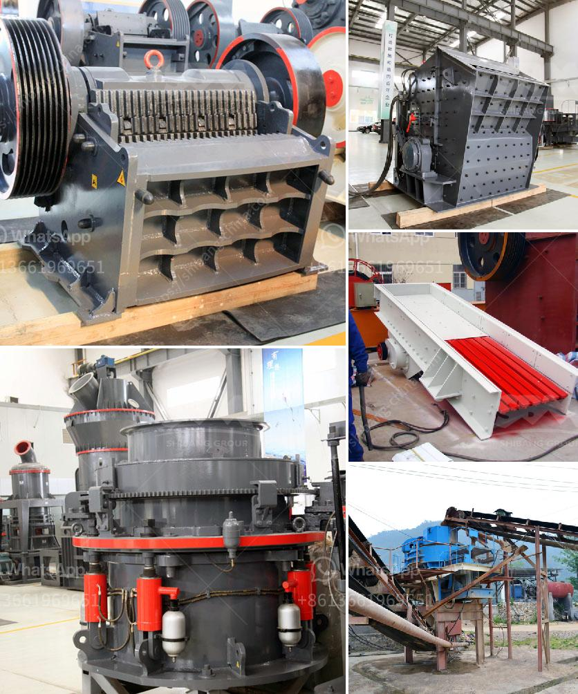

<h3>cement grinding mills</h3>
Cement grinding mills are used for grinding the cement clinker into fine powder. The grinding process is the final stage of cement production and it involves grinding clinker, gypsum, and mixed materials to produce the desired cement product.

Cement grinding mills are usually divided into two types: horizontal mills and vertical mills. Horizontal mills consist of a rotating tube filled with steel balls or flint pebbles. As the tube rotates, the grinding media crushes the clinker, while the rotating action of the tube ensures a more uniform grind. Vertical mills, on the other hand, have a vertical orientation and utilize the grinding media on the outer surface of the mill, which results in a more efficient grinding process.

The main function of cement grinding mills is to grind the cement clinker into the required size. There are several factors that influence the efficiency and performance of a cement grinding mill, including the specific surface area, moisture content, grinding media size, and the efficiency of the separator. The specific surface area refers to the particle size distribution of the cement, which affects its strength and setting time. The moisture content of the cement also plays a crucial role in the grinding process, as excessive moisture can result in difficulties in grinding and cause subsequent quality issues.

Grinding media size is another important factor in cement grinding mills. The size and type of grinding media can significantly affect the grinding efficiency, as smaller media provide a larger surface area for grinding and allow for a more efficient grinding process. The efficiency of the separator, which separates the fine particles from the coarse ones, is also crucial in determining the overall performance of the mill.

Another important aspect of cement grinding mills is their energy consumption. The grinding process is highly energy-intensive, and improvements in energy efficiency can result in significant cost savings. Modern grinding mills are designed with energy efficiency in mind, incorporating features such as high-pressure grinding rolls, advanced separator systems, and pre-grinders. These technologies help to reduce the energy consumption per ton of cement produced, therefore reducing the overall carbon footprint of the cement industry.

In conclusion, cement grinding mills play a crucial role in the cement production process by grinding the clinker into fine powder. The efficiency and performance of these mills are influenced by various factors, including the specific surface area, moisture content, grinding media size, and the efficiency of the separator. Additionally, the energy consumption of grinding mills is an important consideration for the sustainability of the cement industry. With continual advancements in technology, cement grinding mills are becoming more efficient, resulting in improved productivity and reduced environmental impact.
<h3>Contact us</h3><ul><li><strong>Whatsapp:&nbsp;<a href="https://wa.me/8613661969651">+8613661969651</a></strong></li><li><a href="https://swt.shibang-china.com/?git&amp;zhl&amp;cement grinding mills"><strong>Online Service(chat now)</strong></a></li></ul><h3>Related</h3><ul><li><a href='philippines stone crusher philippines.md'>philippines stone crusher philippines</a></li><li><a href='sand making machine suppliers in south africa.md'>sand making machine suppliers in south africa</a></li><li><a href='buy mobile crusher.md'>buy mobile crusher</a></li><li><a href='grinding mill machine in ethiopia.md'>grinding mill machine in ethiopia</a></li><li><a href='feldspar refining and processing equipment.md'>feldspar refining and processing equipment</a></li></ul>