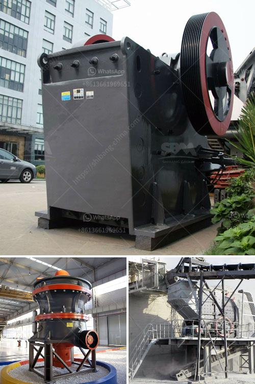

<h3>cement grinding plant layout</h3>
Cement grinding plant layout plays a significant role in cement production. It directly determines the production efficiency of the cement industry and influences the overall production cost. To achieve sustainable and efficient production, cement grinding plant layout must consider the selection of appropriate equipment, distribution of plant area, and the layout of conveying and handling systems.

An optimal cement grinding plant layout avoids the use of extensive land space, reduces the transmission cost of raw materials, and minimizes transportation and installation costs. Therefore, the layout should be compact and have a logical flow from one process to another. Raw materials should be stored close to the grinding plant to minimize the distance for transportation, which increases efficiency and reduces fuel consumption.

Moreover, equipment selection is crucial for a cement grinding plant layout. Consideration should be given to the size, power, and efficiency of the machinery. For example, a ball mill is commonly used for grinding cement clinker in the final stages of cement production. Its versatile design allows it to operate in dry or wet conditions, making it suitable for grinding a wide range of materials. Other equipment, such as vertical roller mills, crushers, and classifiers, should also be considered based on the specific requirements of the cement production process.

Conveying and handling systems also play a vital role in a cement grinding plant layout. Material transport between various processes must be seamless and efficient to minimize downtime and optimize production. Conveyors, elevators, and storage systems should be strategically placed to ensure smooth material flow, reducing the risk of bottlenecks.

In conclusion, a well-thought-out cement grinding plant layout is essential for the success of any cement manufacturing operation. By considering factors such as equipment selection, distribution of plant area, and the layout of conveying and handling systems, a compact and efficient layout can be achieved. This will ultimately result in improved production efficiency, reduced costs, and greater sustainability in the cement industry.
<h3>Contact us</h3><ul><li><strong>Whatsapp:&nbsp;<a href="https://wa.me/8613661969651">+8613661969651</a></strong></li><li><a href="https://swt.shibang-china.com/?git&amp;zhl&amp;cement grinding plant layout"><strong>Online Service(chat now)</strong></a></li></ul><h3>Related</h3><ul><li><a href='cost effective small mobilized jaw crusher.md'>cost effective small mobilized jaw crusher</a></li><li><a href='spec vibrating screen.md'>spec vibrating screen</a></li><li><a href='copper making process.md'>copper making process</a></li><li><a href='dolomite crushing machine for sale dubai.md'>dolomite crushing machine for sale dubai</a></li><li><a href='coal processing plant crusher.md'>coal processing plant crusher</a></li></ul>