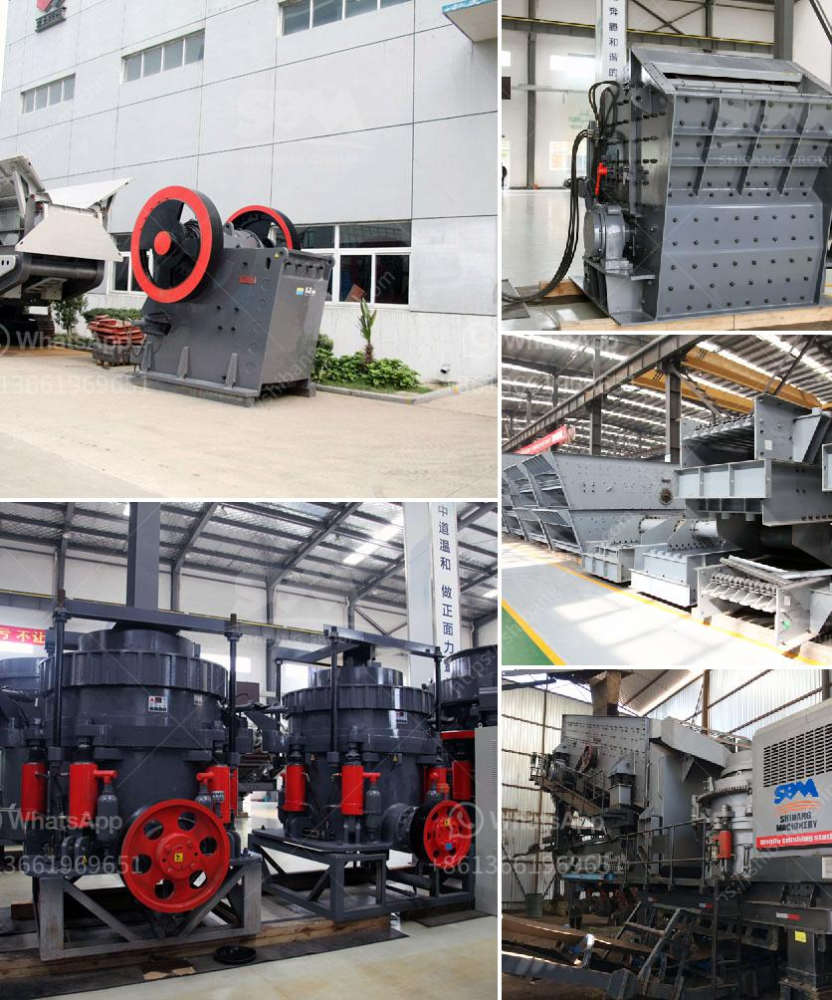

<h3>cement grinding units manufacturing in bangalore</h3>
Cement grinding units play a vital role in the cement manufacturing industry in Bangalore. With the continuous growth of the city's infrastructure, the demand for cement is constantly on the rise. Bangalore is known for its high-quality cement manufacturing units, which cater to the needs of both domestic and international markets.

Cement grinding units are responsible for smoothly grinding the clinker and gypsum into fine powder, which is then used for making cement. These units are equipped with modern machinery and technology, ensuring efficient grinding and production of cement.

One of the key advantages of having cement grinding units in Bangalore is the availability of raw materials. The city is strategically located near limestone reserves, which are the primary source of clinker, one of the main components of cement. This proximity saves transportation costs and makes the manufacturing process more cost-effective.

Moreover, Bangalore's cement grinding units are known for their advanced automation systems. These units adopt the latest technological advancements to enhance productivity, reduce energy consumption, and minimize human errors. This ensures consistent product quality and reduces environmental impact.

Furthermore, cement grinding units in Bangalore contribute to the city's employment sector. They create job opportunities for a significant number of skilled and unskilled workers. This boosts the local economy and improves the standard of living for the residents.

Additionally, the presence of cement grinding units in Bangalore promotes healthy competition among manufacturers. This leads to better product quality, increased production capacity, and competitive pricing. Customers can choose from a wide range of cement varieties, ensuring their construction projects' specific requirements are met.

In conclusion, cement grinding units in Bangalore are crucial for the city's sustainable development. They enable efficient cement production, employment generation, and contribute to the growth of the construction industry. With continuous advancements in technology and increasing demand, these units are vital for meeting the cement requirements of Bangalore and beyond.
<h3>Contact us</h3><ul><li><strong>Whatsapp:&nbsp;<a href="https://wa.me/8613661969651">+8613661969651</a></strong></li><li><a href="https://swt.shibang-china.com/?git&amp;zhl&amp;cement grinding units manufacturing in bangalore"><strong>Online Service(chat now)</strong></a></li></ul><h3>Related</h3><ul><li><a href='working principle of pebble mill.md'>working principle of pebble mill</a></li><li><a href='rotary kiln cement plant cost in india.md'>rotary kiln cement plant cost in india</a></li><li><a href='caco3 plant parts.md'>caco3 plant parts</a></li><li><a href='sale of old hammer crusher.md'>sale of old hammer crusher</a></li><li><a href='semi industrial stone crusher.md'>semi industrial stone crusher</a></li></ul>