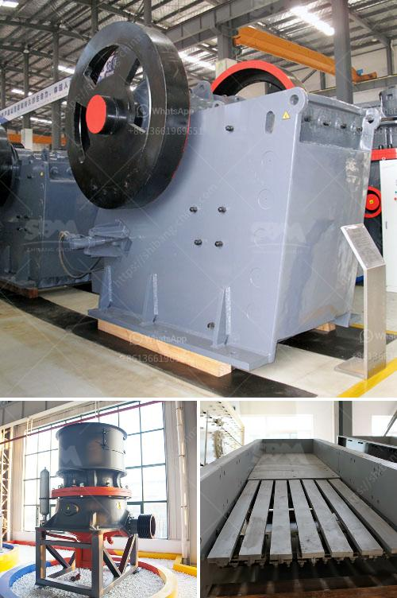

<h3>cement making process</h3>
Cement is one of the most commonly used materials in construction. It is a powdery substance made by calcining lime and clay, and then grinding it to a fine powder. Cement acts as a binding agent, holding together aggregates such as sand and gravel to form concrete, which is used for various construction purposes.

The cement-making process involves several steps, each requiring specific machinery and equipment. Let's take a closer look at these steps.

Firstly, the raw materials are extracted from quarries and mines. Limestone, clay, shale, and silica sand are the main components required for cement production. These raw materials are carefully selected and analyzed to ensure quality and consistency.

Next, the raw materials are crushed and transported to a designated storage area. Crushing is done using heavy-duty crushers that reduce the size of the raw materials to a more manageable level. Once crushed, the materials are transported via conveyor belts or pumps to storage silos.

After storage, the raw materials are homogenized by blending them together. This step ensures that the desired chemical composition is achieved and maintained throughout the production process. The blending process is usually carried out in dedicated blending beds or silos equipped with automated systems.

The homogenized raw materials are then fed into a rotary kiln. The kiln is a long, cylindrical furnace, usually inclined at a slight angle. It is heated to a high temperature, typically around 1,400 to 1,600 degrees Celsius. This intense heat causes several chemical reactions to occur within the kiln, resulting in the formation of clinker.

Clinker is a dark gray nodular material that is produced by sintering limestone and clay at high temperatures. It is the key ingredient in cement production and is typically composed of calcium silicates, aluminates, and ferrites. The clinker is then cooled rapidly, usually by air or water, to prevent it from recombining and losing its desirable properties.

The cooled clinker is then ground into a fine powder using a ball mill or vertical roller mill. The grinding process increases the surface area of the clinker, allowing it to react more readily with water and form cementitious compounds. Moreover, additives such as gypsum may be added during the grinding process to control the setting time and enhance strength development.

Finally, the cement is stored in silos or packed into bags for distribution. The storage conditions are crucial to maintain the quality of the cement, ensuring that it remains free from moisture and other contaminants.

In conclusion, the cement-making process involves various stages, from extracting raw materials to grinding the clinker into a fine powder. Each step requires specialized machinery and equipment to ensure the production of high-quality cement. As a vital component in construction, cement plays a significant role in building strong and durable structures.
<h3>Contact us</h3><ul><li><strong>Whatsapp:&nbsp;<a href="https://wa.me/8613661969651">+8613661969651</a></strong></li><li><a href="https://swt.shibang-china.com/?git&amp;zhl&amp;cement making process"><strong>Online Service(chat now)</strong></a></li></ul><h3>Related</h3><ul><li><a href='harga stone crusher 250 ton.md'>harga stone crusher 250 ton</a></li><li><a href='lokomo jaw crusher.md'>lokomo jaw crusher</a></li><li><a href='mobile stone crusher control systems.md'>mobile stone crusher control systems</a></li><li><a href='equipment design of coal washing plant.md'>equipment design of coal washing plant</a></li><li><a href='grinding and packing machines in pakistan.md'>grinding and packing machines in pakistan</a></li></ul>