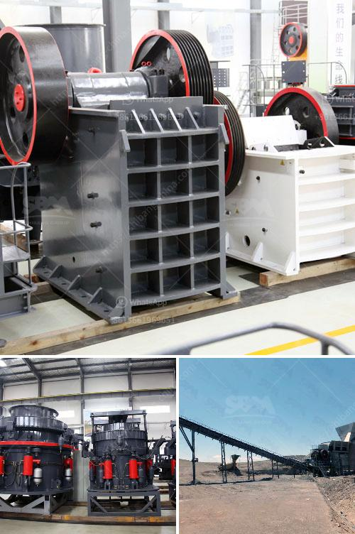

<h3>cement manufacturing plant</h3>
Cement is one of the most essential building materials used worldwide. It is a crucial component in the construction industry, playing a vital role in the production of concrete, mortar, and various other construction materials. Cement manufacturing plants are responsible for producing this fundamental substance, and their importance cannot be overstated.

A cement manufacturing plant is a facility where cement is produced by the mixing and grinding of raw materials, such as limestone, clay, shale, iron ore, and other minerals. These plants typically have a rotary kiln to heat the mixture and a series of conveyors, screens, and separators to control the quality of the final product.

One of the key considerations in establishing a cement manufacturing plant is the availability of raw materials. The plant must be strategically located near deposits of limestone, clay, shale, or other suitable minerals. The transportation of these raw materials from the quarry to the plant is a critical factor in determining the plant's efficiency and operational costs.

The cement manufacturing process involves various stages, including mining and crushing of raw materials, raw mix preparation, clinker production, cement grinding, and packaging. Each stage requires specific equipment, expertise, and stringent quality control measures to ensure consistent and high-quality cement production.

The environmental impact of cement manufacturing plants is a significant concern globally. These plants emit carbon dioxide during the kiln firing process, contributing to greenhouse gas emissions. However, advanced technologies, such as the use of alternative fuels and the development of more energy-efficient and sustainable manufacturing processes, are being adopted to reduce the environmental footprint of cement production.

In conclusion, cement manufacturing plants are essential for the construction industry, delivering the vital material required for building infrastructure worldwide. These plants are intricate systems that require careful planning, efficient operations, and stringent quality control measures. Furthermore, the industry is striving to lessen its environmental impact by adopting sustainable practices and technologies.
<h3>Contact us</h3><ul><li><strong>Whatsapp:&nbsp;<a href="https://wa.me/8613661969651">+8613661969651</a></strong></li><li><a href="https://swt.shibang-china.com/?git&amp;zhl&amp;cement manufacturing plant"><strong>Online Service(chat now)</strong></a></li></ul><h3>Related</h3><ul><li><a href='hammer mill dimension.md'>hammer mill dimension</a></li><li><a href='feldspar refining and processing equipment.md'>feldspar refining and processing equipment</a></li><li><a href='crusher plant price komatsu.md'>crusher plant price komatsu</a></li><li><a href='mobile jaw crusher with rotary screen.md'>mobile jaw crusher with rotary screen</a></li><li><a href='mineral crushing plant.md'>mineral crushing plant</a></li></ul>