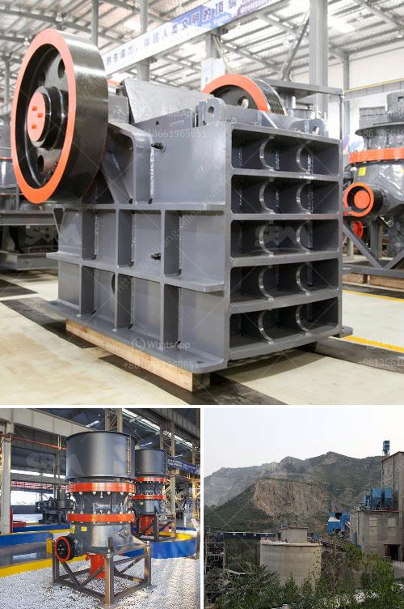

<h3>cement manufacturing process pdf</h3>
Cement manufacturing is an intricate process that involves several steps and activities to produce high-quality cement. Cement is a binding agent used in construction works to bind and hold materials such as sand, gravel, and limestone together.

The cement manufacturing process begins with the extraction of raw materials, primarily limestone and clay, from quarries or mines. These raw materials are crushed and then transported to a cement plant where they are stored and pre-homogenized for further processing.

Once the raw materials are prepared, they undergo a series of steps to obtain the desired cement product. The first step is the blending of the raw materials, which involves mixing limestone and clay in a specific proportion. This mixture is then fed into a cement kiln, which is a long, rotating furnace. The intense heat in the kiln temperatures the raw materials to approximately 2700°F (1480°C), turning them into small, marble-sized pieces called clinker.

The clinker is then ground with gypsum and other additives, such as pozzolans or fly ash, to produce cement. This grinding process occurs in a vertical or horizontal grinding mill using steel balls as the grinding media. The final product, cement, is stored in silos before being packed and dispatched for use in construction projects.

The cement manufacturing process is energy-intensive and involves the release of carbon dioxide (CO2) emissions. Efforts are being made in the industry to reduce these emissions by using alternative fuels and incorporating carbon capture and storage technologies.

In conclusion, cement manufacturing is a complex process that involves several stages and activities. It is crucial to follow strict quality control measures to ensure the production of high-quality cement that meets industry standards. Efforts in the industry are ongoing to make the process more sustainable and environmentally friendly.
<h3>Contact us</h3><ul><li><strong>Whatsapp:&nbsp;<a href="https://wa.me/8613661969651">+8613661969651</a></strong></li><li><a href="https://swt.shibang-china.com/?git&amp;zhl&amp;cement manufacturing process pdf"><strong>Online Service(chat now)</strong></a></li></ul><h3>Related</h3><ul><li><a href='precipitated calcium carbonate production plant design.md'>precipitated calcium carbonate production plant design</a></li><li><a href='crusher machine distributor in zambia.md'>crusher machine distributor in zambia</a></li><li><a href='to do with the stone crusher.md'>to do with the stone crusher</a></li><li><a href='mica powder mill malaysia.md'>mica powder mill malaysia</a></li><li><a href='diamond mining equipment.md'>diamond mining equipment</a></li></ul>