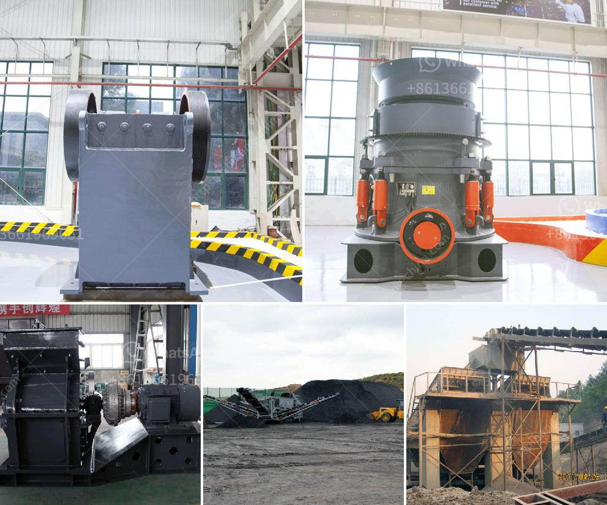

<h3>cement plant for sale south africa</h3>
South Africa, known for its rich mineral resources, has long been a key player in the global cement industry. With cement production accounting for a significant percentage of the country's GDP, the sale of cement plants in South Africa has become a lucrative opportunity for investors.

One such opportunity is the sale of a cement plant in South Africa. These plants are highly sought after due to their strategic location in a country that is experiencing rapid infrastructure development. As the government continues to invest in various projects such as roads, bridges, and housing, the demand for cement is expected to soar in the coming years.

A cement plant for sale in South Africa offers several advantages for potential investors. Firstly, the well-established cement market provides a stable foundation for growth and profitability. With a growing population and urbanization, the demand for cement is poised to increase exponentially in the near future.

Secondly, the availability of raw materials is abundant in South Africa. The country is home to limestone reserves, which are a key component in cement production. This not only reduces reliance on imports but also ensures a consistent supply of raw materials at competitive prices.

Furthermore, South Africa's cement plants have adopted modern technology and efficient production processes. This not only enables lower production costs but also reduces the carbon footprint associated with cement production. The use of advanced cement kilns and energy-efficient machinery also allows for higher production capacity and improved output quality.

Investing in a cement plant in South Africa offers great potential for growth and profitability. With a favorable business environment and a booming construction industry, the sale of such plants can yield substantial returns on investment. Additionally, the government's commitment to infrastructure development further strengthens the long-term prospects of cement production in South Africa.

In conclusion, a cement plant for sale in South Africa presents a golden opportunity for investors looking to tap into the growing cement market. With favorable conditions, abundant raw materials, and modern production processes, investing in such a venture can be highly profitable. As the country continues its march towards development, the demand for cement is only set to rise, making it an attractive and lucrative investment option.
<h3>Contact us</h3><ul><li><strong>Whatsapp:&nbsp;<a href="https://wa.me/8613661969651">+8613661969651</a></strong></li><li><a href="https://swt.shibang-china.com/?git&amp;zhl&amp;cement plant for sale south africa"><strong>Online Service(chat now)</strong></a></li></ul><h3>Related</h3><ul><li><a href='chromite processing plant equipment for pakistan.md'>chromite processing plant equipment for pakistan</a></li><li><a href='gypsum production machinery.md'>gypsum production machinery</a></li><li><a href='concrete crusher for sale ethiopia.md'>concrete crusher for sale ethiopia</a></li><li><a href='how to made talcum powder.md'>how to made talcum powder</a></li><li><a href='raymond mill price list.md'>raymond mill price list</a></li></ul>