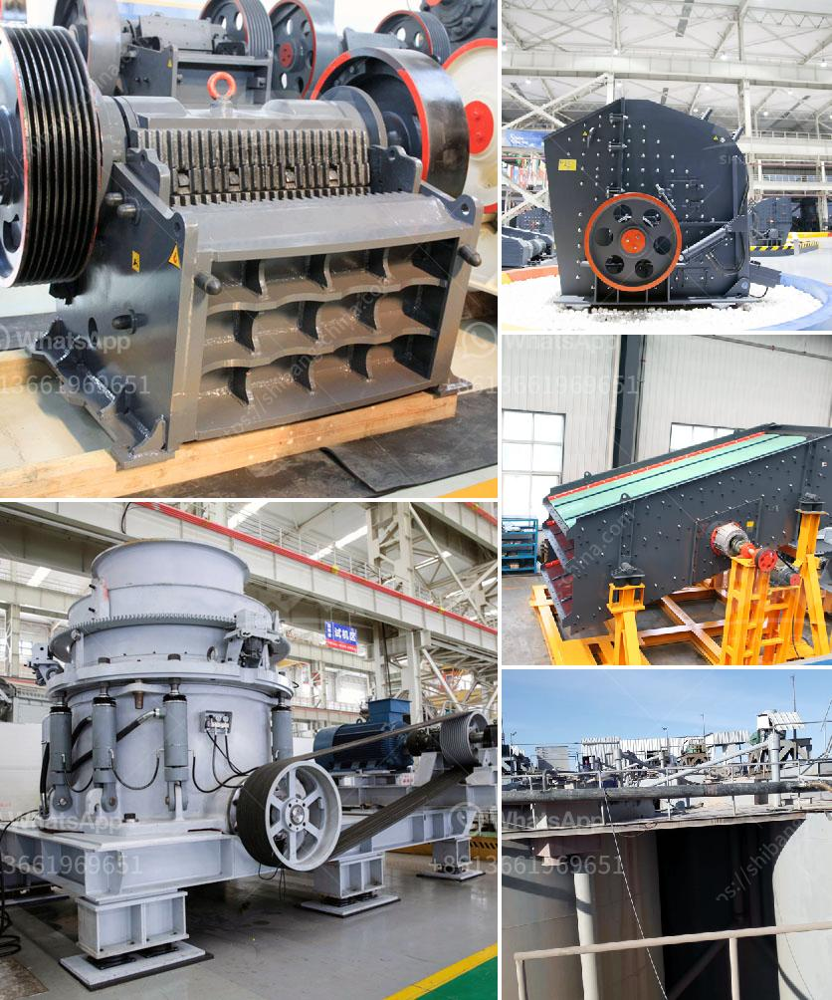

<h3>cement plant in india cement plant</h3>
India is the second-largest cement producer in the world, after China. The cement industry in India plays a significant role in the country's economy, contributing to its infrastructure development and employment generation. One of the crucial components of this industry is the cement plant, which is responsible for the production of cement.

A cement plant is a facility that manufactures cement by combining limestone, clay, and other materials through a series of complex chemical reactions. These reactions occur in large kilns, where the raw materials are heated to extremely high temperatures, creating what is known as "clinker." This clinker is then ground into a fine powder, which is the final product known as cement.

India has a vast network of cement plants situated across various states, which cater to the growing demands of cement in both domestic and international markets. These plants are equipped with state-of-the-art technology and machinery to ensure high-quality cement production. The production capacity of these plants varies, ranging from a few hundred tons per day to several thousand tons per day.

One of the critical factors for the success of a cement plant in India is its strategic location. It is crucial to be situated near limestone reserves as limestone is a primary raw material used in cement production. The availability of limestone near the plant ensures a continuous and cost-effective supply of raw material. Additionally, proximity to transportation networks, such as highways and railways, helps in the efficient distribution of cement to various markets.

The cement industry in India is highly competitive, with numerous cement companies operating in the market. Each company strives to differentiate itself by offering superior quality cement and innovative products to meet the diverse needs of customers. The cement plants invest heavily in research and development to improve their manufacturing processes and reduce the environmental impact of cement production.

Furthermore, the cement plants in India actively contribute to the country's sustainable development goals. They focus on reducing carbon emissions, conserving energy, optimizing water usage, and promoting alternative fuels. Many cement plants have adopted cutting-edge technologies and practices, such as waste heat recovery systems, dry process kilns, and the usage of renewable energy sources like solar and wind power. These initiatives not only reduce the environmental footprint of cement production but also help in reducing operational costs for the plants.

Apart from their contribution to the economy and environmental sustainability, cement plants also play a significant role in generating employment opportunities in India. The construction of a cement plant involves a substantial workforce, from skilled engineers and technicians to manual laborers. Additionally, downstream industries such as logistics, packaging, construction materials, and real estate benefit from the presence of cement plants, creating indirect employment opportunities.

In conclusion, the Indian cement industry, with its numerous cement plants, is a vital component of the country's economy. These plants produce high-quality cement, contribute to infrastructure development, generate employment, and embrace sustainable practices. With the government's continued focus on infrastructure development and affordable housing schemes, the demand for cement is expected to grow further, leading to the expansion and modernization of existing cement plants and the establishment of new ones.
<h3>Contact us</h3><ul><li><strong>Whatsapp:&nbsp;<a href="https://wa.me/8613661969651">+8613661969651</a></strong></li><li><a href="https://swt.shibang-china.com/?git&amp;zhl&amp;cement plant in india cement plant"><strong>Online Service(chat now)</strong></a></li></ul><h3>Related</h3><ul><li><a href='chilli crushing machine project report.md'>chilli crushing machine project report</a></li><li><a href='hard rock quarry cursher in libya.md'>hard rock quarry cursher in libya</a></li><li><a href='hammer mill dimension.md'>hammer mill dimension</a></li><li><a href='barite rock mill.md'>barite rock mill</a></li><li><a href='sand making machine suppliers in south africa.md'>sand making machine suppliers in south africa</a></li></ul>