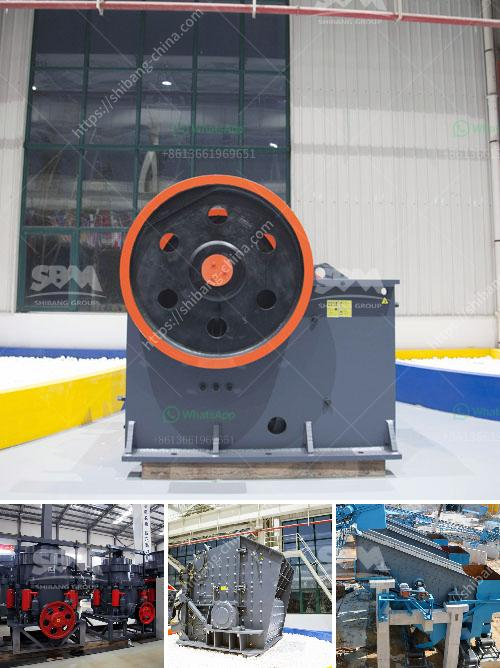

<h3>cement plants for sale</h3>
Investors often search for lucrative business opportunities in industries with high growth potential. In recent years, cement production has witnessed a significant spike, driven by the increasing demand for infrastructure development and urbanization worldwide. Cement plants have become a profitable venture attracting investors looking to capitalize on this global trend.

The sale of cement plants has caught the attention of many investors due to its potential for substantial returns. Cement is an integral component of the construction industry, serving as a building block for bridges, roads, and buildings. As demand for cement rises, governments and private companies are constantly seeking ways to meet this demand, presenting a golden opportunity for investors to step in and profit.

Investing in cement plants for sale offers several advantages. Firstly, it allows investors to tap into a rapidly expanding market with a high demand for cement. The construction industry is booming, especially in developing countries, as they aim to improve infrastructure and accommodate growing populations. This ensures a consistent demand for cement, guaranteeing a stable revenue stream for investors.

Secondly, cement plants for sale provide investors with the advantage of cost efficiency. Purchasing an existing cement plant eliminates the need for building one from scratch, which can be a time-consuming and expensive process. With a ready-made facility, investors can focus on scaling up production and optimizing operations to maximize profitability in a shorter timeframe.

Furthermore, cement plants for sale often come equipped with state-of-the-art technology and advanced production processes. This modernization reduces operational costs, enhances productivity, and ensures compliance with environmental regulations, making businesses more sustainable and attractive to potential partners or buyers in the future.

However, investing in cement plants for sale requires thorough due diligence. Evaluating factors such as location feasibility, operational costs, and market dynamics is crucial. Engaging industry experts or consultants can help investors make informed decisions and avoid potential pitfalls.

Whether aiming to enter the cement production industry or expand an existing business, investing in cement plants for sale presents a lucrative opportunity. The consistently high demand for cement coupled with cost efficiency and modernization possibilities make it an attractive investment option. As long as investors conduct due diligence and navigate the market wisely, cement plants for sale can be a profitable venture that contributes to fulfilling global infrastructure needs.
<h3>Contact us</h3><ul><li><strong>Whatsapp:&nbsp;<a href="https://wa.me/8613661969651">+8613661969651</a></strong></li><li><a href="https://swt.shibang-china.com/?git&amp;zhl&amp;cement plants for sale"><strong>Online Service(chat now)</strong></a></li></ul><h3>Related</h3><ul><li><a href='grinding machines for clay.md'>grinding machines for clay</a></li><li><a href='ball mill manufacturer in sri lanka.md'>ball mill manufacturer in sri lanka</a></li><li><a href='sand making machine cost.md'>sand making machine cost</a></li><li><a href='rock crushers ball mill.md'>rock crushers ball mill</a></li><li><a href='best machine for marble processing.md'>best machine for marble processing</a></li></ul>