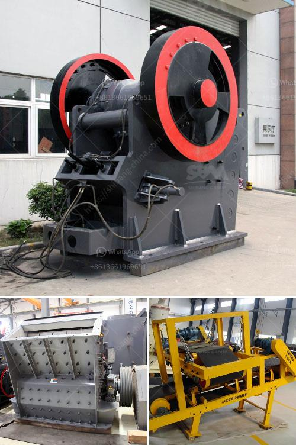

<h3>central crushing granite</h3>
Granite, an igneous rock known for its durability and beauty, has become a popular choice for various construction projects. From residential homes to commercial buildings, granite is utilized for flooring, countertops, and accent walls, just to name a few. However, before these stunning granite pieces can be installed, they must undergo a crushing process. This is where the concept of central crushing comes into play.

Central crushing refers to the centralized process of crushing granite at a specific location, usually a quarry site, rather than transporting tons of raw material to various construction sites. This technique offers numerous advantages, making it an ideal solution for crushing granite efficiently and effectively.

One of the primary benefits of central crushing is cost savings. By establishing a central location solely dedicated to the crushing process, transportation costs are significantly reduced. Instead of hauling heavy granite blocks from the quarry site to the construction site, contractors can transport crushed granite, which weighs significantly less. This not only saves money on fuel but also reduces wear and tear on vehicles, leading to lower maintenance costs in the long run.

In addition to cost savings, central crushing also offers time efficiency. Constructing and maintaining numerous crushing plants at various construction sites can be time-consuming and complex. By centralizing the process, time and effort spent on setting up multiple sites are eliminated. This allows for a more streamlined operation, ultimately leading to faster project completion and increased productivity.

Furthermore, central crushing promotes sustainability by reducing the carbon footprint. With fewer vehicles needed for transportation, the emission of harmful greenhouse gases is greatly reduced. Additionally, central crushing reduces the need for multiple sites, decreasing the impact on land resources and preserving the natural habitat.

To ensure the success of central crushing, high-quality equipment is essential. The machinery used in this process needs to be robust, reliable, and capable of handling heavy materials. Crushers specifically designed for granite crushing are equipped with features such as powerful motors, strong jaw plates, and efficient hydraulic systems. These elements enable efficient crushing and ensure the production of consistent, high-quality crushed granite.

Furthermore, safety measures play a crucial role in central crushing operations. Promoting a safe working environment is critical to protect workers and prevent accidents. Adequate training and the implementation of safety protocols should be prioritized. Additionally, regular maintenance and periodic inspections of the equipment are essential to identify and address any potential risks or issues promptly.

In conclusion, central crushing has emerged as the ultimate solution for efficiently crushing granite. Its cost-saving advantages, time efficiency, sustainability, and utilization of high-quality equipment make it an attractive choice for contractors involved in various construction projects. As the demand for granite continues to grow, central crushing offers a reliable and practical approach for meeting this demand while still maintaining environmental responsibility.
<h3>Contact us</h3><ul><li><strong>Whatsapp:&nbsp;<a href="https://wa.me/8613661969651">+8613661969651</a></strong></li><li><a href="https://swt.shibang-china.com/?git&amp;zhl&amp;central crushing granite"><strong>Online Service(chat now)</strong></a></li></ul><h3>Related</h3><ul><li><a href='barite rock mill.md'>barite rock mill</a></li><li><a href='chromite processing plant equipment for pakistan.md'>chromite processing plant equipment for pakistan</a></li><li><a href='conveyor belts raw material prices.md'>conveyor belts raw material prices</a></li><li><a href='overland conveyor cost calculator.md'>overland conveyor cost calculator</a></li><li><a href='stone crusher 200 ton per.md'>stone crusher 200 ton per</a></li></ul>