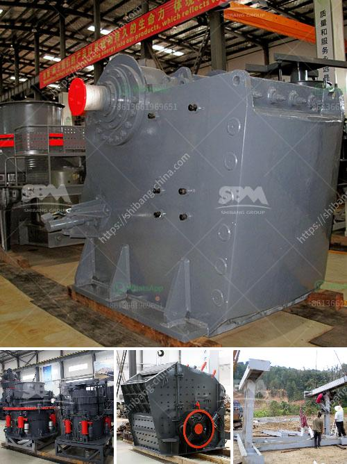

<h3>chalcopyrite ore processing plant cost to built and sale</h3>
Chalcopyrite is a copper iron sulfide mineral often characterized by a golden yellow color. Chalcopyrite is commonly found in and extracted from sulfide ore deposits, and is considered one of the most important copper ores. Due to its various uses in electrical, chemical, and construction industries, chalcopyrite ore processing plant cost becomes crucial.

Building a chalcopyrite ore processing plant involves extensive capital investment, which can be categorized into equipment cost, site preparation, civil work, and others. The equipment cost includes crushers, conveyors, ore grinding mills, flotation cells, magnetic separators, and other equipment necessary for the processing plant. The site preparation involves land clearing, leveling, and soil testing. Civil work refers to the construction of buildings, foundations, and other infrastructure required for the plant's operation.

The cost of building a chalcopyrite ore processing plant can vary depending on factors such as the scale of the operation, location, labor cost, and market conditions. Generally, a small-scale processing plant with limited capacity would entail lower costs compared to larger plants designed for extensive production.

Apart from the initial construction cost, operating and maintenance costs should also be taken into consideration. These costs include labor, energy, water, and other resources required for the routine functioning of the plant. Market conditions, such as copper prices and demand, can also impact the profitability and sale of the processed ore.

Once the chalcopyrite ore processing plant is built and in operation, the processed ore can be sold to copper smelters and refineries. The sale of the processed ore provides revenue and enables further investment in the operation, ensuring sustainable production and profitability.

In conclusion, building and selling a chalcopyrite ore processing plant involves significant investment and cost considerations. The economic feasibility of such a project depends on several factors, including market conditions, scale of operation, and ongoing operating expenses. Careful planning and analysis are crucial to assess the cost and potential profitability of a chalcopyrite ore processing plant.
<h3>Contact us</h3><ul><li><strong>Whatsapp:&nbsp;<a href="https://wa.me/8613661969651">+8613661969651</a></strong></li><li><a href="https://swt.shibang-china.com/?git&amp;zhl&amp;chalcopyrite ore processing plant cost to built and sale"><strong>Online Service(chat now)</strong></a></li></ul><h3>Related</h3><ul><li><a href='gold plant for sale south africa.md'>gold plant for sale south africa</a></li><li><a href='crushing and screening market in india.md'>crushing and screening market in india</a></li><li><a href='setup for limestone crusher plant.md'>setup for limestone crusher plant</a></li><li><a href='lme copper ore price calculations.md'>lme copper ore price calculations</a></li><li><a href='different type of grinding mills.md'>different type of grinding mills</a></li></ul>