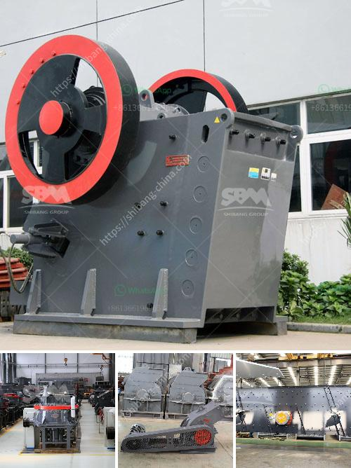

<h3>charcoal pulverizer machine philippines</h3>
The Philippines is known for its rich sources of charcoal, which is widely used as an alternative to traditional fuel sources. However, producing and grinding charcoal can often be a time-consuming and labor-intensive process. This is where the charcoal pulverizer machine comes into play.

A charcoal pulverizer machine is a piece of equipment that is used to crush charcoal chunks into fine charcoal powder. This machine is specifically designed for making high-quality charcoal powder, which is an essential ingredient in the production of charcoal briquettes.

One of the key advantages of using a charcoal pulverizer machine in the Philippines is its ability to produce a consistent and uniform charcoal powder. This is important in the manufacturing process, as a uniform powder ensures that the charcoal briquettes will have consistent burning properties.

Another advantage of using a charcoal pulverizer machine is its efficiency. The machine is designed to maximize the yield of charcoal powder from the raw material, minimizing waste and increasing profitability. This is particularly beneficial in a country like the Philippines, where charcoal is in high demand and the production needs to be cost-effective.

Furthermore, a charcoal pulverizer machine is easy to operate and maintain. The machine is equipped with user-friendly controls and requires minimal training to operate. Additionally, the machine is designed to be durable and requires only basic maintenance, ensuring that it can be used for a long time without any significant repairs or replacements.

In conclusion, a charcoal pulverizer machine is an essential tool for charcoal producers in the Philippines. It offers numerous advantages, including the production of consistent and high-quality charcoal powder, increased efficiency, and ease of operation and maintenance. Investing in this machine can greatly improve the productivity and profitability of charcoal production, making it a worthwhile investment for any charcoal producer in the Philippines.
<h3>Contact us</h3><ul><li><strong>Whatsapp:&nbsp;<a href="https://wa.me/8613661969651">+8613661969651</a></strong></li><li><a href="https://swt.shibang-china.com/?git&amp;zhl&amp;charcoal pulverizer machine philippines"><strong>Online Service(chat now)</strong></a></li></ul><h3>Related</h3><ul><li><a href='cement grinding units manufacturing in bangalore.md'>cement grinding units manufacturing in bangalore</a></li><li><a href='ball mill to buy in peru.md'>ball mill to buy in peru</a></li><li><a href='turkey plant production line of gypsum powder.md'>turkey plant production line of gypsum powder</a></li><li><a href='grinding raymond mill for sale.md'>grinding raymond mill for sale</a></li><li><a href='gypsum manufacturing plant.md'>gypsum manufacturing plant</a></li></ul>