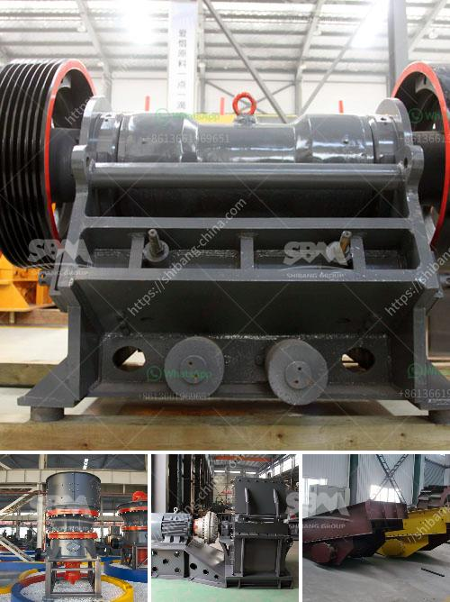

<h3>chili grinding milling</h3>
When it comes to adding a spicy kick to our dishes, chili peppers are the undisputed champions. Their fiery flavors have been mesmerizing taste buds for centuries, and they continue to be an essential ingredient in various cuisines around the world. However, in order to fully unleash and extract the full potential of these flavorful peppers, the process of chili grinding milling becomes crucial.

Chili grinding milling is the art of transforming dried chili peppers into chili powder, a versatile spice that can be used in countless recipes. This process not only intensifies the flavors of the peppers but also ensures that the powder is fine and uniform, allowing it to blend effortlessly into dishes and elevate their taste profiles.

To begin the chili grinding milling process, the first step is to select the right chili peppers. Typically, dried chili peppers such as cayenne, habanero, ancho, or jalapeno are chosen for their vibrant colors and distinct flavors. It's essential to choose peppers that are free from moisture, mold, and any other signs of spoilage.

After the selection, the peppers are thoroughly cleaned to remove any dirt and debris. This step is crucial to maintain the hygiene and quality of the final product. Once cleaned, the peppers are ready to be ground into powder.

Traditionally, chili grinding milling was done manually using a mortar and pestle. This method requires a great deal of time, effort, and physical strength. However, modern technology has introduced electric or manual chili grinders that make the process much more efficient and convenient.

Electric chili grinders are the preferred method for commercial production as they can handle large quantities of peppers. These grinders consist of a motor that rotates blades or burrs, grinding the dried chili peppers into a fine powder. They often come with adjustable settings to control the coarseness of the powder, allowing chefs and cooks to customize the intensity of flavors.

On the other hand, manual chili grinders offer a more hands-on approach, enabling individuals to savor the traditional charm of chili grinding milling in their own kitchens. They typically consist of a handle-operated mechanism that crushes the peppers and grinds them into a powder. While the output may be smaller in quantity, the manual process allows for greater control over the texture and ensures a consistent grind.

Once the chili peppers have been ground into a fine powder, they should be stored in airtight containers away from direct sunlight and moisture. This helps preserve their flavors and extend their shelf life for future use.

From enhancing the taste of salsas and stews to giving an extra kick to marinades and rubs, chili powder is a versatile spice that holds the power to transform any dish. Thanks to the art of chili grinding milling, we can unlock the full potential of these fiery peppers and take our culinary creations to new heights of flavor.
<h3>Contact us</h3><ul><li><strong>Whatsapp:&nbsp;<a href="https://wa.me/8613661969651">+8613661969651</a></strong></li><li><a href="https://swt.shibang-china.com/?git&amp;zhl&amp;chili grinding milling"><strong>Online Service(chat now)</strong></a></li></ul><h3>Related</h3><ul><li><a href='sell artificial sand mill.md'>sell artificial sand mill</a></li><li><a href='vibrating screen in south africa.md'>vibrating screen in south africa</a></li><li><a href='pulviriser machine in allahabad.md'>pulviriser machine in allahabad</a></li><li><a href='coal fired power plants contractors in vietnam.md'>coal fired power plants contractors in vietnam</a></li><li><a href='graphite processing and beneficiation.md'>graphite processing and beneficiation</a></li></ul>