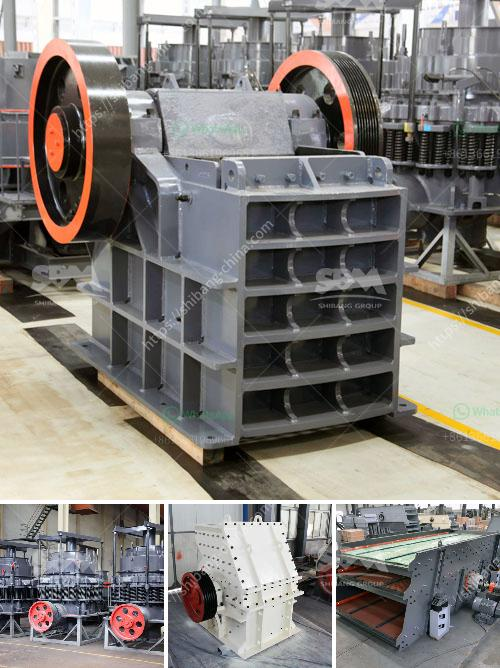

<h3>chilli crushing machine project report</h3>
Chili, also known as red pepper, is an important crop in many countries. It is widely used as a spice to add heat and flavor to various cuisines around the world. To cater to the growing demand for crushed chili, a chili crushing machine project was initiated in order to automate the process of chili crushing and make it more efficient.

The main objective of the chili crushing machine project is to design and fabricate a machine that can crush chili to the desired size and consistency. This machine aims to reduce the human effort and time involved in the crushing process, while also improving the quality and yield of the crushed chili.

The first step in the project was to design a machine that could effectively crush chili. The design involved analyzing the requirements and constraints of the crushing process, such as the desired size of the crushed chili and the available space for the machine. Various designs were explored, and the most suitable one was selected.

Once the design was finalized, the fabrication of the machine was carried out. Skilled technicians and engineers were involved in building the machine using high-quality materials and components. The fabrication process involved cutting, welding, drilling, and assembly of various parts to create the final product.

After the machine was fabricated, it underwent rigorous testing to ensure its performance and reliability. Tests were conducted to evaluate the crushing capacity, efficiency, and consistency of the machine. Any issues or inefficiencies were identified and resolved during this phase.

The chili crushing machine project was successful in achieving its objectives. The machine demonstrated excellent performance in terms of crushing capacity, efficiency, and consistency. It was able to crush chilies to the desired size and consistency, thereby meeting the requirements of the users. The machine also significantly reduced the manual effort and time required for chili crushing, leading to increased productivity.

The chili crushing machine project aimed to design, fabricate, and test a machine that could automate the chili crushing process and make it more efficient. The project successfully achieved its objectives and resulted in the development of a high-quality machine that is capable of crushing chilies to the desired size and consistency. The machine offers numerous benefits, including reduced manual effort, increased productivity, and improved quality and yield of crushed chili.

The chili crushing machine project has immense scope for future enhancements and improvements. Some potential areas for further development include integrating automation features, such as automatic feeding and discharging of chili, and incorporating safety features to ensure the well-being of operators. Additionally, research could be conducted to explore the possibility of utilizing the machine for crushing other spices and herbs, thereby expanding its application and market potential.

Overall, the chili crushing machine project has been a successful endeavor, providing a reliable and efficient solution for the crushing of chili. It serves as a valuable tool for chili producers and processors, enabling them to save time and effort while maintaining high-quality standards.
<h3>Contact us</h3><ul><li><strong>Whatsapp:&nbsp;<a href="https://wa.me/8613661969651">+8613661969651</a></strong></li><li><a href="https://swt.shibang-china.com/?git&amp;zhl&amp;chilli crushing machine project report"><strong>Online Service(chat now)</strong></a></li></ul><h3>Related</h3><ul><li><a href='price quotation for rotary kiln machine.md'>price quotation for rotary kiln machine</a></li><li><a href='stone crushing machines in uk.md'>stone crushing machines in uk</a></li><li><a href='conveyor belts manufacturers south africa.md'>conveyor belts manufacturers south africa</a></li><li><a href='bauxite processing plant.md'>bauxite processing plant</a></li><li><a href='ball mill lining made in china.md'>ball mill lining made in china</a></li></ul>