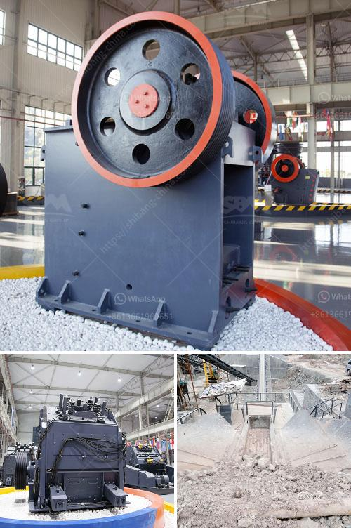

<h3>chilli powder making machine india price</h3>
Chilli powder is a staple ingredient used in many Indian cuisines to add that extra kick of spice and flavor. Traditionally, making chilli powder involved a labor-intensive process of sun-drying the chillies, manually grinding them, and then sieving the powder to remove any impurities. However, with technological advancements, chilli powder making machines have become a game-changer.

In India, the market for chilli powder making machines has grown significantly, thanks to their efficiency, time-saving capabilities, and affordability. These machines not only simplify the process but also produce a superior quality powder that is consistent in taste and texture.

The price of chilli powder making machines in India varies depending on various factors such as machine capacity, features, and brand. The entry-level models with a lower capacity usually come at a price range of around INR 10,000 to 20,000. These machines are suitable for small-scale production or home use.

On the other hand, high-capacity machines, designed for commercial production, can cost anywhere between INR 50,000 to several lakhs, depending on the size and features. These advanced machines often offer additional features like multiple grinding stages, high-speed operations, and automatic temperature control.

Apart from the initial investment, it is important to consider the overall operational costs, maintenance requirements, and power consumption when evaluating the price of a chilli powder making machine. It is advisable to research and compare different brands and models to find the one that best fits your requirements and budget.

Investing in a chilli powder making machine in India comes with multiple benefits. Firstly, it eliminates the need for manual labor, allowing for efficient production and higher output. Secondly, it ensures consistent quality and purity of the chilli powder, reducing the risk of contamination. Lastly, it saves significant time and effort, enabling manufacturers to meet the growing demands of the market.

In conclusion, chilli powder making machines have revolutionized the traditional process of making spice powders. With an ever-growing market and the availability of a wide range of machines at varying prices, manufacturers in India can now easily find a chilli powder making machine that suits their needs and budget. So, if you're in the market to spice up your production, investing in a chilli powder making machine might just be the perfect solution.
<h3>Contact us</h3><ul><li><strong>Whatsapp:&nbsp;<a href="https://wa.me/8613661969651">+8613661969651</a></strong></li><li><a href="https://swt.shibang-china.com/?git&amp;zhl&amp;chilli powder making machine india price"><strong>Online Service(chat now)</strong></a></li></ul><h3>Related</h3><ul><li><a href='vertical hammer crusher.md'>vertical hammer crusher</a></li><li><a href='format of the business plan for stone crusher.md'>format of the business plan for stone crusher</a></li><li><a href='komatsu mobile impact crusher.md'>komatsu mobile impact crusher</a></li><li><a href='copper making process.md'>copper making process</a></li><li><a href='gold mining equipments africa.md'>gold mining equipments africa</a></li></ul>