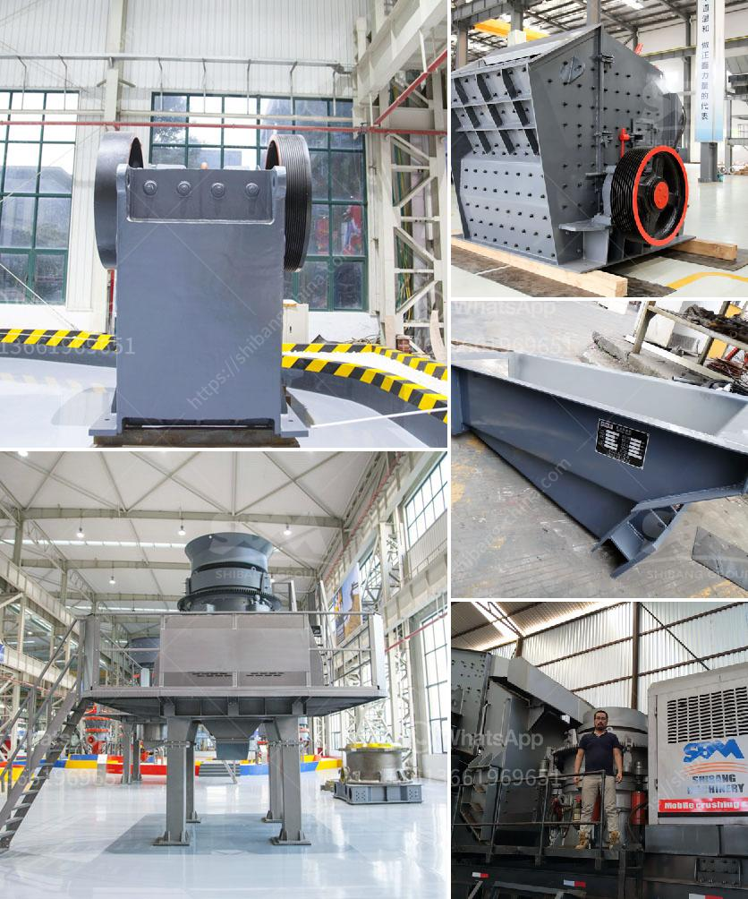

<h3>china clay washing process</h3>
China clay, also known as kaolin, is a white, soft, and naturally occurring mineral. It is extensively used in the manufacture of porcelain, paper, ceramics, paints, and various other products. The process of washing china clay involves several stages, each designed to improve the quality and purity of the clay.

The first stage in the china clay washing process is removal of impurities such as vegetation, rocks, and other debris. This is achieved through a careful screening process, where the clay is passed through vibrating screens that remove larger particles.

Once the preliminary screening is complete, the clay is then subjected to a process called hydrocycloning. This is a technique that uses water to separate the fine clay particles from the coarser particles. The mixture of clay and water is pumped into a hydrocyclone, which is a conical-shaped vessel with a tangential inlet. As the mixture enters the hydrocyclone, it starts to spin rapidly, causing the heavier particles to settle at the bottom while the lighter particles, primarily clay, are carried upwards.

After hydrocycloning, the clay slurry is pumped into settling tanks. In these tanks, the clay particles gradually settle to the bottom due to gravity. This process allows for further separation of impurities, such as sand and mica, which are heavier than the clay and sink to the bottom along with any remaining coarse particles. The clarified water on top is carefully decanted and reused in the process, saving both water and energy.

Once the settling process is complete, the clay slurry is sent to a filter press. The filter press consists of a series of plates covered with filter cloth that allow the water to pass through while retaining the clay particles. As the slurry is pumped into the filter press, the water is forced out, leaving behind a cake-like substance consisting of clay. This cake is then discharged from the press, while the water is collected and returned to the settling tanks for reuse.

The final step in the china clay washing process is drying. The clay is spread out in thin layers to facilitate evaporation of moisture. This can be done using various methods, such as air drying or using hot air ovens. The dried clay is then ready for the next stage of processing, which may include crushing, grinding, or further purification, depending on the intended use of the clay.

Overall, the washing process of china clay plays a crucial role in ensuring the quality and purity of the final product. It involves the careful removal of impurities, separation of particles based on their density, and efficient water management. These steps not only improve the performance of the clay in various applications but also contribute to sustainable resource management by minimizing waste and conserving water.
<h3>Contact us</h3><ul><li><strong>Whatsapp:&nbsp;<a href="https://wa.me/8613661969651">+8613661969651</a></strong></li><li><a href="https://swt.shibang-china.com/?git&amp;zhl&amp;china clay washing process"><strong>Online Service(chat now)</strong></a></li></ul><h3>Related</h3><ul><li><a href='calcite powder grinding mill sale.md'>calcite powder grinding mill sale</a></li><li><a href='stone medina stone mobile crusher.md'>stone medina stone mobile crusher</a></li><li><a href='cocount crushing manchine.md'>cocount crushing manchine</a></li><li><a href='material ball mills.md'>material ball mills</a></li><li><a href='list of cement plants in nalgonda district.md'>list of cement plants in nalgonda district</a></li></ul>