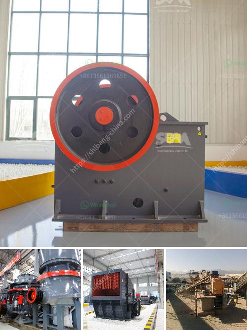

<h3>china portable jaw crusher plant manufacturers china</h3>
China is undoubtedly a market leader in the manufacturing sector. Manufacturing industries in China, such as textiles, chemicals, food, machinery, and automobiles, have witnessed unprecedented growth in recent years. This has fuelled the demand for efficient crushing and screening equipment, which in turn has boosted the growth of the portable jaw crusher plant market in China.

Portable jaw crusher plants are designed for the recycling of construction waste and the processing of natural stones and minerals. These portable plants provide a combination of crushing efficiency and mobility, making them an attractive choice for contractors, quarry operators, and mining applications.

China has a rich industrial base of crushing equipment manufacturers, which ensures that China portable jaw crusher plant manufacturers are actively involved in the production of quality equipment. Due to the fierce competition in the market, manufacturers are striving to increase their market share by improving product quality, researching and developing new technologies, and emphasizing on product innovation.

In recent years, China's economic environment has been favorable for the development and growth of the mobile crushing plant industry. The country's urbanization process, rapid infrastructural development, and increasing construction activities have resulted in a huge demand for portable jaw crusher plants. As a result, manufacturers are producing the machinery in large quantities to meet the ever-increasing demand.

China portable jaw crusher plant manufacturers are also expanding their international footprint by exporting their equipment to other parts of the world. They are investing in research and development, manufacturing facilities, and marketing and distribution strategies to cater to the global market. This has resulted in China becoming a leading exporter of portable jaw crusher plants.

The primary advantage of China portable jaw crusher plant is its expansive range of applications. Similar to stationary crushers, portable jaw crusher plants are available in numerous models and sizes, ranging from 30tph to 500tph. This versatility ensures that users can efficiently process various materials, including construction waste, asphalt, concrete, bricks, and rocks, to produce high-quality aggregates for construction projects.

Additionally, China portable jaw crusher plants are known for their reliability, durability, and low operation costs. The machines are equipped with advanced features, such as hydraulic systems, intelligent control systems, and energy-saving technologies. These features enhance the overall productivity and efficiency of the crushing process, reducing downtime and maximizing profits for users.

Furthermore, China portable jaw crusher plant manufacturers are focused on environmental sustainability. They are investing in technologies that promote energy efficiency and reduce carbon emissions. These efforts align with China's commitment towards achieving a low-carbon economy and addressing environmental concerns.

In conclusion, China is the global leader in the manufacturing of portable jaw crusher plants. The country's manufacturing sector is robust and well-established, with numerous manufacturers competing to gain market share. China portable jaw crusher plant manufacturers are striving to enhance their international presence by delivering quality, innovative products to customers worldwide. With their wide range of applications, reliability, durability, and focus on sustainability, China portable jaw crusher plants are an excellent choice for industries involved in construction, mining, and quarrying.
<h3>Contact us</h3><ul><li><strong>Whatsapp:&nbsp;<a href="https://wa.me/8613661969651">+8613661969651</a></strong></li><li><a href="https://swt.shibang-china.com/?git&amp;zhl&amp;china portable jaw crusher plant manufacturers china"><strong>Online Service(chat now)</strong></a></li></ul><h3>Related</h3><ul><li><a href='stone crasher busness plan pdf.md'>stone crasher busness plan pdf</a></li><li><a href='sample proposal to supply mining equipment.md'>sample proposal to supply mining equipment</a></li><li><a href='price of roller crushers in usa.md'>price of roller crushers in usa</a></li><li><a href='sell artificial sand mill.md'>sell artificial sand mill</a></li><li><a href='jaw crusher pe 500 x 750 price.md'>jaw crusher pe 500 x 750 price</a></li></ul>