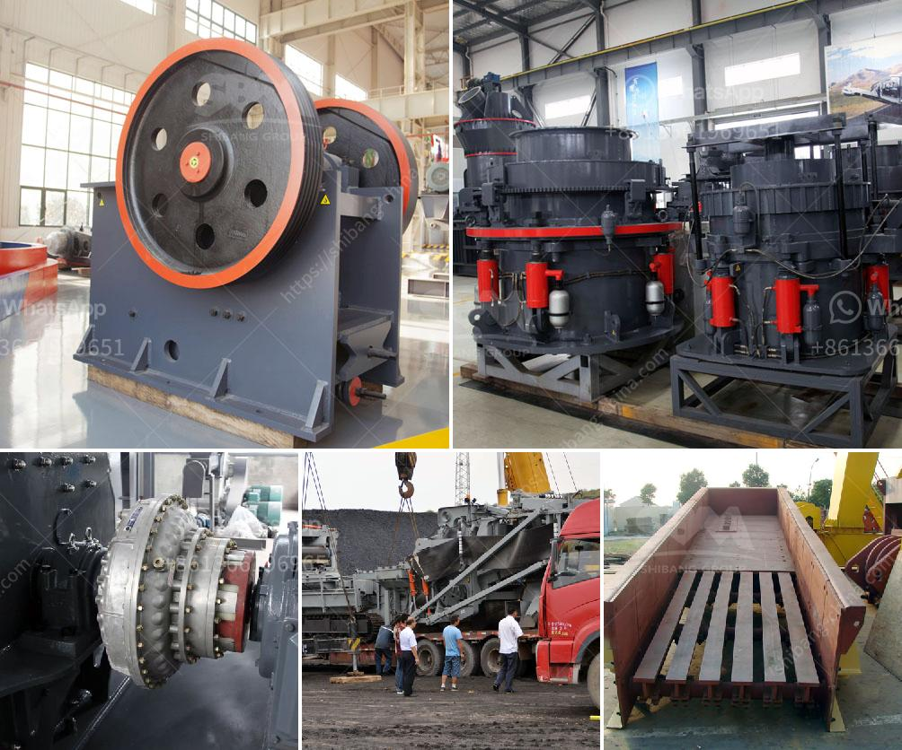

<h3>china silica sand vibrating separator screen</h3>
China Silica Sand Vibrating Separator Screen: A Key Equipment to Ensure Quality in Industrial Processes

Silica sand is a crucial component in many industrial processes. Its high purity is essential for ensuring the quality and durability of various products, such as glass, ceramics, and electronics. To achieve this level of purity, the silica sand needs to be effectively separated and purified. This is where the China silica sand vibrating separator screen comes into play.

The silica sand vibrating separator screen is a piece of equipment specially designed for the separation of silica sand particles by size. It is widely used in both wet and dry applications, and it plays an important role in protecting the further processing of silica sand.

One of the key features of the China silica sand vibrating separator screen is its high efficiency. With several screens placed on top of each other, the vibrating separator can effectively remove impurities while allowing the silica sand to pass through uninterrupted. This ensures a more effective and thorough separation process, resulting in a higher-quality end product.

The vibrating separator screen also offers versatility in terms of customization. Depending on the specific requirements of the application, the screen can be equipped with different mesh sizes and additional features, such as ultrasonic vibration or self-cleaning mechanisms. This adaptability makes it suitable for a wide range of industries, including mining, petrochemicals, and construction.

In addition to its separation capabilities, the silica sand vibrating separator screen also provides convenience and ease of use. Its simple design allows for easy maintenance and cleaning, reducing downtime and ensuring smooth operation. Moreover, its compact size allows for easy installation and integration into existing production lines.

Furthermore, the China silica sand vibrating separator screen is built to withstand harsh operating conditions. Its robust construction, high-quality materials, and advanced engineering ensure durability and longevity, even in demanding environments. This further contributes to its cost-effectiveness and reliability.

In conclusion, the China silica sand vibrating separator screen is a vital equipment in industrial processes for the separation and purification of silica sand. By efficiently removing impurities and ensuring accurate particle size distribution, it helps to enhance the quality and durability of various products. With its high efficiency, versatility, and easy maintenance, this vibrating separator screen is a valuable asset for industries that rely on high-quality silica sand.
<h3>Contact us</h3><ul><li><strong>Whatsapp:&nbsp;<a href="https://wa.me/8613661969651">+8613661969651</a></strong></li><li><a href="https://swt.shibang-china.com/?git&amp;zhl&amp;china silica sand vibrating separator screen"><strong>Online Service(chat now)</strong></a></li></ul><h3>Related</h3><ul><li><a href='equipment needed for quarry crusher.md'>equipment needed for quarry crusher</a></li><li><a href='modular conveyor belt supplier china.md'>modular conveyor belt supplier china</a></li><li><a href='primary cone crusher.md'>primary cone crusher</a></li><li><a href='super fine roller mill.md'>super fine roller mill</a></li><li><a href='coal crusher and screening plants for sale.md'>coal crusher and screening plants for sale</a></li></ul>