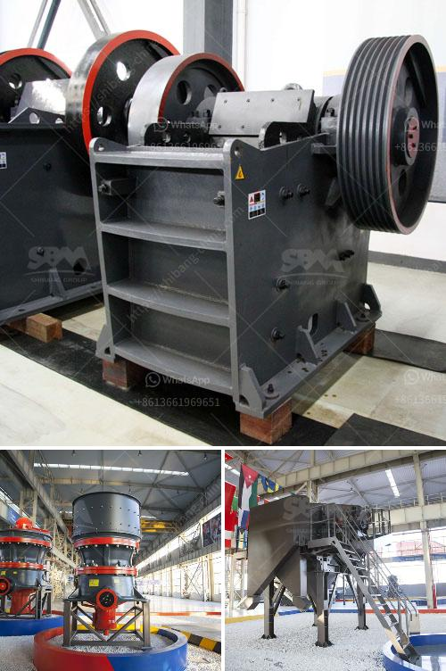

<h3>china stone crusher machine</h3>
China Stone Crusher Machine: A Stone Crusher Machine with higher capacity is more expensive than lower capacity.

Such as, the jaw crusher which can process 2200 t / h is expensive than the jaw crusher which just can process 200 t / h.

The Stone Crusher Machines produced by latest technology is more expensive than the normal Stone Crusher Machines.

Different distance and polices will result in different shipping costs and customs fees. In fact, they also affects the price of Stone Crusher Machines.

Different Materials used in Stone Crusher Machine body, wear parts, accessories result in different prices. Materials used in our Stone Crusher Machines are the best quality metal, so it can ensure the quality and service-life of Stone Crusher Machines.

If you want to know more details about our Stone Crusher Machine, please leave us a message, then our engineers will make a detailed plan according to your requirements.
<h3>Contact us</h3><ul><li><strong>Whatsapp:&nbsp;<a href="https://wa.me/8613661969651">+8613661969651</a></strong></li><li><a href="https://swt.shibang-china.com/?git&amp;zhl&amp;china stone crusher machine"><strong>Online Service(chat now)</strong></a></li></ul><h3>Related</h3><ul><li><a href='manufacturers of coal mill in india.md'>manufacturers of coal mill in india</a></li><li><a href='stones grinding plant thailand.md'>stones grinding plant thailand</a></li><li><a href='slag crushing plant.md'>slag crushing plant</a></li><li><a href='primary crusher ball milling pengertian.md'>primary crusher ball milling pengertian</a></li><li><a href='stone crushing machine cost.md'>stone crushing machine cost</a></li></ul>