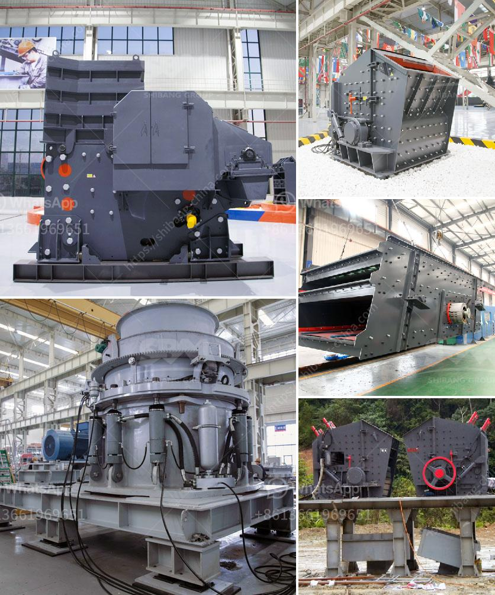

<h3>chinese crusher plants</h3>
China, as a country, has been striving for economic growth and technological advancements over the past few decades. With a population of over 1.4 billion people, the demand for construction materials and infrastructure development has been colossal. To cater to this ever-increasing demand, Chinese crusher plants have played a significant role in processing and recycling different types of materials, providing sustainable solutions.

These crusher plants, also known as stone crushing plants, are widely utilized in the mining, construction, and energy industries. They are capable of breaking down various types of rocks and stones into smaller, more manageable sizes. This process allows for the generation of crushed stones, gravels, and materials that can be used for various purposes in the construction industry.

One of the key features of Chinese crusher plants is their ability to recycle materials effectively. The crushing process involves the use of powerful machines that can crush, screen, and separate different materials. This allows for the reuse of waste materials such as concrete, asphalt, and bricks, which significantly reduces the need for new extraction processes. By recycling materials, these crusher plants contribute to the conservation of natural resources, reduction in landfill waste, and a greener environment.

Additionally, Chinese crusher plants have been designed to be energy-efficient and environmentally friendly. Advanced technologies and innovations have been employed to ensure the reduction of energy consumption and harmful emissions during the crushing process. From utilizing electric motors to incorporating dust suppression systems, these plants prioritize sustainability in their operations. This not only benefits the environment but also helps companies comply with stricter regulations and guidelines concerning emissions and energy conservation.

Furthermore, Chinese crusher plants have been continuously improved and modernized to meet the growing demands of the industry. The development of advanced automation systems and intelligent control mechanisms has revolutionized the efficiency and productivity of these plants. With the integration of these technologies, processes such as feeding, crushing, and sorting can be automated, resulting in higher throughputs, reduced labor costs, and improved overall performance.

Chinese crusher plants have not only been crucial in meeting the nation's construction requirements but have also become major players in the international market. With their high-quality products, competitive prices, and excellent after-sales service, these plants have gained recognition and trust from customers worldwide. Many construction companies and infrastructure developers have relied on Chinese crusher plants to ensure the timely and efficient completion of their projects.

In conclusion, Chinese crusher plants have become a sustainable solution for crushing needs in the construction industry. Their ability to recycle materials, focus on energy efficiency, and incorporation of advanced automation technologies make them an ideal choice for processing rocks and stones. As China continues to progress in its economic development, these plants will play a crucial role in supporting the nation's construction demands and advancing sustainability goals.
<h3>Contact us</h3><ul><li><strong>Whatsapp:&nbsp;<a href="https://wa.me/8613661969651">+8613661969651</a></strong></li><li><a href="https://swt.shibang-china.com/?git&amp;zhl&amp;chinese crusher plants"><strong>Online Service(chat now)</strong></a></li></ul><h3>Related</h3><ul><li><a href='ball mill machinery manufacturer india.md'>ball mill machinery manufacturer india</a></li><li><a href='clay grinding machine price list in andhra pradesh.md'>clay grinding machine price list in andhra pradesh</a></li><li><a href='coal wash and crusher machine.md'>coal wash and crusher machine</a></li><li><a href='ball mill supplier in pune.md'>ball mill supplier in pune</a></li><li><a href='cost gypsum processing machines.md'>cost gypsum processing machines</a></li></ul>