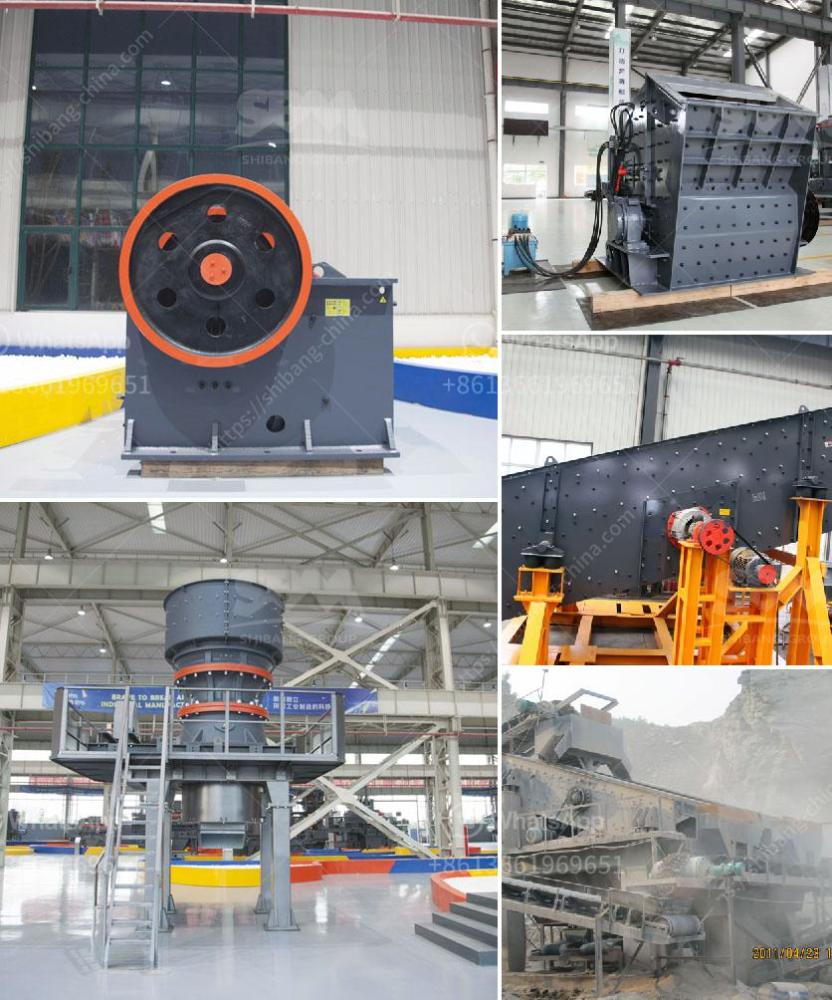

<h3>chrome processing manufacturers india</h3>
Chrome is an essential component in various industries, from automotive to aerospace, and its production plays a crucial role in the manufacturing sector. India, being one of the leading players in the global chrome processing industry, has emerged as a significant supplier of this critical material.

The chrome processing manufacturers in India have made commendable advancements in their techniques and technologies. They have established efficient extraction and processing methods to retrieve chrome ore from the mines. The country is blessed with abundant reserves of chromite, making it an attractive destination for chrome processing.

One of the key reasons behind India's success in chrome processing is its skilled workforce. The manufacturers have invested in training and upskilling their employees to operate advanced machinery and adopt modern processing techniques. This has helped them in improving productivity and producing high-quality chrome products that meet international standards.

Additionally, the government's favorable policies and initiatives have also contributed to the growth of the chrome processing industry in India. The authorities have undertaken measures to promote investment in the sector, such as providing tax incentives and supporting research and development activities.

The chrome processing manufacturers in India cater to both domestic and international markets. Their products are widely used in various applications, including stainless steel production, metal plating, and chemical manufacturing. The manufacturers ensure that their chrome products meet the specific requirements of their customers, considering factors like size, grade, and purity.

Furthermore, India's chrome processing manufacturers are increasingly adopting sustainable practices to minimize environmental impact. They are implementing recycling programs to reduce waste and conserve resources. Additionally, they are actively working towards reducing greenhouse gas emissions and promoting responsible mining practices.

In conclusion, the chrome processing manufacturers in India have established a strong presence in the global market due to their advanced processing techniques, skilled workforce, and favorable government policies. Their commitment to quality and sustainability makes them reliable suppliers of chrome products for various industries. With continuous innovation and investment in research, India is poised to maintain its position as a formidable player in the chrome processing industry.
<h3>Contact us</h3><ul><li><strong>Whatsapp:&nbsp;<a href="https://wa.me/8613661969651">+8613661969651</a></strong></li><li><a href="https://swt.shibang-china.com/?git&amp;zhl&amp;chrome processing manufacturers india"><strong>Online Service(chat now)</strong></a></li></ul><h3>Related</h3><ul><li><a href='wet process and dry process of cement.md'>wet process and dry process of cement</a></li><li><a href='gold mining equipment manufacturers in europe.md'>gold mining equipment manufacturers in europe</a></li><li><a href='material ball mills.md'>material ball mills</a></li><li><a href='stone principle crusher project.md'>stone principle crusher project</a></li><li><a href='chilli powder making machine india price.md'>chilli powder making machine india price</a></li></ul>