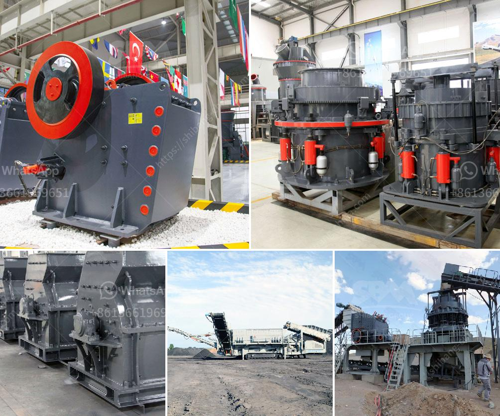

<h3>chrome sands washing plant with prices</h3>
Chrome ore is an essential raw material for various industries, including stainless steel production, pigment manufacturing, refractory bricks, and chemical production. To obtain marketable chrome concentrates, the chrome mining process includes several stages, among which the washing plant plays a crucial role.

A chrome sands washing plant is a facility where the chrome ore is processed through a series of mechanical equipment, such as log washers, rotary scrubbers, and spiral classifiers, to remove impurities and create a marketable chrome concentrate. This process not only improves the ore quality but also increases its economic value by separating the valuable chrome from waste materials.

The cost of a chrome sands washing plant is dependent on various factors, including its capacity, the technology employed, and the quality of equipment used. Typically, the price range for these plants can vary widely, from several hundred thousand dollars to millions of dollars. Let's explore some of the key components and their associated costs.

The primary stage equipment in a chrome sands washing plant consists of a vibrating grizzly feeder, a jaw crusher, and a primary screen. This equipment is responsible for the initial processing of raw ore and can cost anywhere from $50,000 to $200,000, depending on the manufacturer and the quality of the machinery.

The washing equipment in a chrome sands washing plant typically includes log washers, rotary scrubbers, and spiral classifiers. These machines play a crucial role in removing impurities from the ore and producing a clean chrome concentrate. The cost of this equipment can range from $200,000 to $500,000, depending on the size and capacity of the plant.

Chrome ore processing generates significant amounts of water and slurry, which need to be properly managed to ensure environmental compliance. The cost of a slurry and water management system can vary depending on the required infrastructure, such as settling ponds, thickening tanks, and water recycling facilities. Typically, the cost for such systems ranges from $100,000 to $300,000.

To optimize the chrome washing process and ensure efficient operation, chrome sands washing plants often utilize advanced control and automation systems. These systems help monitor and regulate various parameters, such as feed rate, water flow, and product quality. The cost of implementing control and automation systems in a washing plant can start from $50,000 and go up to several hundred thousand dollars.

It is important to note that the prices mentioned for the chrome sands washing plant components are estimated ranges and subject to change based on various factors, such as market conditions, technology advancements, and the specific requirements of each plant.

In conclusion, a chrome sands washing plant is a critical component in the chrome mining process, enabling the production of marketable chrome concentrates. The prices for these plants can vary widely based on factors like capacity, equipment quality, and technological advancements. Investing in high-quality equipment and efficient systems is essential to ensure optimal chrome ore processing and maximize the economic value of the final product.
<h3>Contact us</h3><ul><li><strong>Whatsapp:&nbsp;<a href="https://wa.me/8613661969651">+8613661969651</a></strong></li><li><a href="https://swt.shibang-china.com/?git&amp;zhl&amp;chrome sands washing plant with prices"><strong>Online Service(chat now)</strong></a></li></ul><h3>Related</h3><ul><li><a href='industrial crusher for sale.md'>industrial crusher for sale</a></li><li><a href='jaw crusher with protection.md'>jaw crusher with protection</a></li><li><a href='crushing and grinding processes of platinum.md'>crushing and grinding processes of platinum</a></li><li><a href='calcium carbonate crushers.md'>calcium carbonate crushers</a></li><li><a href='grinding or crushing for gypsum pdf.md'>grinding or crushing for gypsum pdf</a></li></ul>