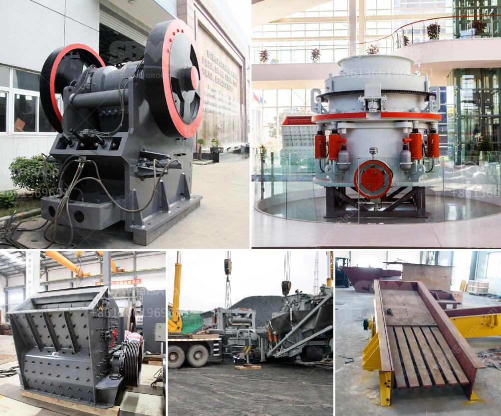

<h3>chrome wash plant operational diagram</h3>
A chrome wash plant is a facility that is used to wash chrome-bearing ores or gravels to remove impurities such as clay or silts. Chrome ore is typically mined from open-pit mines and then either processed for further beneficiation or loaded onto trucks and transported to a wash plant for washing.

The operational diagram of a chrome wash plant typically includes several stages, each with its specific purpose. These stages can vary depending on the specific design of the plant, but generally, the main stages involved are as follows:

1. Feeding: The first stage involves the feeding of chrome-bearing ores or gravels into the wash plant. This can be done through a conveyor belt system or by directly dumping the material into a hopper.

2. Screening: After the ores or gravels are fed into the wash plant, they go through a screening process. This involves the use of screens with different-sized holes to classify the material into different sizes. This step helps to remove larger particles that may hinder the efficiency of subsequent stages.

3. Scrubbing: The scrubbing stage is crucial for removing impurities such as clay or silts from the chrome-bearing material. It involves the use of rotating drums or scrubbers that agitate the material while water is sprayed onto it. This process helps to break down the clay or silts and wash them away.

4. Sizing: After scrubbing, the material is usually further classified into different sizes based on their particle size. This can be done through a vibrating screen or cyclones that separate the material into different fractions.

5. Dewatering: The final stage involves the dewatering of the washed chrome-bearing material. This can be achieved through the use of dewatering screens or hydrocyclones that remove excess water from the material.

Overall, the operational diagram of a chrome wash plant is designed to efficiently wash and remove impurities from chrome-bearing ores or gravels. This process helps to improve the quality of the final product, which can then be further processed for various applications in the chrome industry.
<h3>Contact us</h3><ul><li><strong>Whatsapp:&nbsp;<a href="https://wa.me/8613661969651">+8613661969651</a></strong></li><li><a href="https://swt.shibang-china.com/?git&amp;zhl&amp;chrome wash plant operational diagram"><strong>Online Service(chat now)</strong></a></li></ul><h3>Related</h3><ul><li><a href='rock crushers ball mill.md'>rock crushers ball mill</a></li><li><a href='feldspar vsi crusher.md'>feldspar vsi crusher</a></li><li><a href='cement making process.md'>cement making process</a></li><li><a href='kaolin grinding plant manufacturer in india.md'>kaolin grinding plant manufacturer in india</a></li><li><a href='conveyor belts raw material prices.md'>conveyor belts raw material prices</a></li></ul>